# Image Annotation Tool - Design Documentation

**Version**: 1.0 (Phases 1-7 Complete)
**Last Updated**: December 2024
**Status**: Production-ready with extensibility for ML integration

---

## Table of Contents

1. [Design Philosophy](#design-philosophy)
2. [Architecture Overview](#architecture-overview)
3. [Layer Breakdown](#layer-breakdown)
4. [Class Design](#class-design)
5. [Data Flow & Interactions](#data-flow--interactions)
6. [Design Patterns](#design-patterns)
7. [Extension Points](#extension-points)
8. [Development Guidelines](#development-guidelines)

---

## Design Philosophy

### Core Principles

#### 1. **Separation of Concerns**
- **Three-layer architecture**: UI, Business Logic, Data
- Each layer has a single, well-defined responsibility
- No cross-layer dependencies (only downward dependencies)
- Business logic is **completely framework-agnostic**

#### 2. **Framework Independence**
The business logic layer has **ZERO** dependencies on PyQt6. This enables:
- Easy migration to web (React/Vue + FastAPI)
- Testing without UI framework
- CLI tool development
- Future framework changes without refactoring core logic

```python
# ✅ GOOD - Business logic class
class AnnotationManager:
    def create_annotation(self, image_id: str, box: BoundingBox, label_id: int) -> Annotation:
        # Pure Python, no PyQt imports
        annotation = Annotation(bounding_box=box, label_id=label_id, image_id=image_id)
        self._annotations[annotation.id] = annotation
        return annotation

# ❌ BAD - Business logic with UI dependency
class AnnotationManager:
    def create_annotation(self, image_id: str, box: BoundingBox, label_id: int) -> Annotation:
        from PyQt6.QtWidgets import QMessageBox  # NEVER do this!
        QMessageBox.information(None, "Created", "Annotation created")
```

#### 3. **Testability**
- All core logic is testable without launching the GUI
- Pure functions where possible
- Dependency injection for external dependencies (e.g., file loaders)
- Clear interfaces between layers

#### 4. **Extensibility Over Complexity**
- Simple implementations now, with clear extension points
- Optional features don't add complexity to core
- ML models are optional dependencies
- Clean integration points for future features

#### 5. **User Experience First**
- Keyboard shortcuts for all common actions
- Immediate visual feedback for user actions
- Clear error messages
- Undo-friendly operations (all state changes are reversible)

#### 6. **Data Integrity**
- Immutable core models where possible
- Validation at boundaries (user input, file imports)
- Clear state management
- Atomic operations (annotation creation/deletion)

---

## Architecture Overview

### Three-Layer Architecture


### Layer Dependencies

**Allowed**:
- ✅ UI Layer → Business Logic Layer → Data Layer
- ✅ Any layer → Core Models

**Forbidden**:
- ❌ Business Logic → UI Layer
- ❌ Data Layer → Business Logic or UI Layer
- ❌ Any PyQt imports in Business Logic or Data Layer

---

## Layer Breakdown

### 1. Presentation Layer (UI)

**Location**: `ui/` directory
**Framework**: PyQt6
**Responsibility**: Display information and capture user input

#### Components

**MainWindow** (`ui/main_window.py`)
- Central orchestrator for the application
- Creates and manages all UI components
- Connects signals and slots
- Delegates business logic to managers

**ImageCanvas** (`ui/image_canvas.py`)
- Custom QWidget for displaying images
- Handles drawing annotations
- Mouse interaction for creating/selecting annotations
- Emits signals for annotation events

**AnnotationListWidget** (`ui/annotation_list_widget.py`)
- Displays list of annotations for current image
- Provides Edit/Delete buttons
- Syncs with canvas selection

**Toolbar** (`ui/toolbar.py`)
- Navigation controls (Previous/Next)
- Image counter display
- Mode toggles (Draw/Select)

**Dialogs** (`ui/dialogs.py`)
- `LabelSetupDialog`: Define label set before annotation
- `LabelSelectionDialog`: Choose label for new annotation
- `ExportDialog`: Select export format and path
- `SubdirectoryLoadDialog`: Configure subdirectory loading
- `EditLabelDialog`: Change annotation label

#### Design Rules for UI Layer

1. **No Business Logic**: All logic delegates to managers
2. **Thin Controllers**: MainWindow orchestrates but doesn't implement
3. **Signal-Driven**: Components communicate via Qt signals/slots
4. **Display Only**: UI only displays data, never modifies it directly

```python
# ✅ GOOD - UI delegates to business logic
def _on_create_annotation(self, box: BoundingBox, label_id: int, label_name: str):
    current_image = self.image_manager.get_current_image()
    annotation = self.annotation_manager.create_annotation(
        image_id=current_image.id,
        box=box,
        label_id=label_id,
        label_name=label_name
    )
    current_image.add_annotation(annotation)
    self.canvas.set_annotations(current_image.annotations)

# ❌ BAD - UI implements business logic
def _on_create_annotation(self, box: BoundingBox, label_id: int, label_name: str):
    annotation = Annotation(bounding_box=box, label_id=label_id)
    self._annotations[annotation.id] = annotation  # Business logic in UI!
    if box.width < 10:  # Validation in UI!
        QMessageBox.warning(self, "Too small", "Box too small")
```

---

### 2. Business Logic Layer (Core)

**Location**: `core/` directory
**Dependencies**: None (pure Python + standard library)
**Responsibility**: Application logic, rules, validation

#### Managers

**AnnotationManager** (`core/annotation_manager.py`)
- CRUD operations for annotations
- Annotation validation
- Placeholder for ML model integration (`suggest_annotations`)

```python
class AnnotationManager:
    def __init__(self, validation_enabled: bool = True):
        self._annotations: dict[str, Annotation] = {}
        self._validation_enabled = validation_enabled

    def create_annotation(self, image_id: str, box: BoundingBox,
                         label_id: int, label_name: str) -> Annotation:
        annotation = Annotation(...)
        if self._validation_enabled:
            is_valid, error_msg = self.validate_annotation(annotation)
            if not is_valid:
                raise ValueError(f"Invalid annotation: {error_msg}")
        self._annotations[annotation.id] = annotation
        return annotation

    def validate_annotation(self, annotation: Annotation) -> tuple[bool, str]:
        # Business rules for annotation validity
        if annotation.label_id <= 0:
            return False, "Label ID must be positive"
        if annotation.bounding_box.width <= 0 or annotation.bounding_box.height <= 0:
            return False, "Bounding box must have positive dimensions"
        return True, ""
```

**ImageManager** (`core/image_manager.py`)
- Manages collection of images
- Navigation (next/previous)
- Subdirectory loading
- Current image tracking

```python
class ImageManager:
    def __init__(self):
        self._images: dict[str, ImageMetadata] = {}
        self._image_order: list[str] = []
        self._current_index: int = -1
        self._base_path: Optional[str] = None

    def next_image(self) -> Optional[ImageMetadata]:
        if self._current_index < len(self._image_order) - 1:
            self._current_index += 1
            return self.get_current_image()
        return None

    def load_from_subdirectories(self, config: SubdirectoryConfig,
                                 image_loader) -> int:
        # Load images from multiple subdirs, preserve relative paths
        self._base_path = config.base_path
        loaded_count = 0
        for subdir in config.subdirectories:
            # ... load images, store relative paths in metadata.filename
        return loaded_count
```

**LabelManager** (`core/label_manager.py`)
- Manages label definitions (ID + name pairs)
- Label validation (unique IDs)
- Label retrieval

**ExportService** (`core/export_service.py`)
- Export to CSV format
- Export to COCO JSON format
- Export statistics
- Relative path support (Phase 7)

**ImportService** (`core/import_service.py`)
- Import from COCO JSON
- Three-strategy image path matching
- Label map extraction

#### Core Models (`core/models.py`)

**BoundingBox**
```python
@dataclass
class BoundingBox:
    x: int
    y: int
    width: int
    height: int

    def to_coco_format(self) -> list[float]:
        return [float(self.x), float(self.y),
                float(self.width), float(self.height)]
```

**Annotation**
```python
@dataclass
class Annotation:
    id: str = field(default_factory=lambda: str(uuid.uuid4()))
    bounding_box: Optional[BoundingBox] = None
    label_id: int = 0
    label_name: str = ""
    image_id: str = ""
    created_at: datetime = field(default_factory=datetime.now)
    modified_at: datetime = field(default_factory=datetime.now)

    def update_label(self, label_id: int, label_name: str) -> None:
        self.label_id = label_id
        self.label_name = label_name
        self.modified_at = datetime.now()
```

**ImageMetadata**
```python
@dataclass
class ImageMetadata:
    id: str = field(default_factory=lambda: str(uuid.uuid4()))
    file_path: str = ""
    filename: str = ""  # May contain relative path (Phase 7)
    width: int = 0
    height: int = 0
    format: str = ""
    annotations: list[Annotation] = field(default_factory=list)
```

**SubdirectoryConfig** (Phase 7)
```python
@dataclass
class SubdirectoryConfig:
    base_path: str
    subdirectories: list[str]

    def __post_init__(self):
        # Validate all paths exist
        base = Path(self.base_path)
        if not base.exists():
            raise ValueError(f"Base path does not exist: {self.base_path}")
        for subdir in self.subdirectories:
            full_path = base / subdir
            if not full_path.exists():
                raise ValueError(f"Subdirectory does not exist: {full_path}")
```

---

### 3. Data Layer

**Location**: `data/` directory
**Dependencies**: Pillow, standard library
**Responsibility**: File I/O operations

**ImageLoader** (`data/image_loader.py`)
- Loads images from disk
- Extracts image metadata (dimensions, format)
- Returns PyQt6 QPixmap for display + ImageMetadata

**AnnotationStorage** (`data/annotation_storage.py`)
- Future: Persistence of annotations to disk
- Currently: Handled by ExportService

---

## Class Design

### Class Diagram: Core Domain Models


### Class Diagram: Business Logic Layer

```mermaid
classDiagram
    class AnnotationManager {
        -_annotations: dict~str, Annotation~
        -_validation_enabled: bool
        +create_annotation(image_id, box, label_id, label_name) Annotation
        +get_annotation(annotation_id: str) Optional~Annotation~
        +update_annotation(annotation_id, box, label_id, ...) bool
        +update_annotation_label(annotation_id, label_id, ...) bool
        +delete_annotation(annotation_id: str) bool
        +get_annotations_for_image(image_id: str) list~Annotation~
        +get_all_annotations() list~Annotation~
        +validate_annotation(annotation) tuple~bool, str~
        +suggest_annotations(image_id, model_name) list~Annotation~
    }

    class ImageManager {
        -_images: dict~str, ImageMetadata~
        -_image_order: list~str~
        -_current_index: int
        -_base_path: Optional~str~
        +add_image(file_path: str, metadata: ImageMetadata) str
        +get_current_image() Optional~ImageMetadata~
        +next_image() Optional~ImageMetadata~
        +previous_image() Optional~ImageMetadata~
        +get_image_by_id(image_id: str) Optional~ImageMetadata~
        +get_all_images() list~ImageMetadata~
        +get_current_index() int
        +get_total_images() int
        +set_base_path(base_path: str) void
        +load_from_subdirectories(config, loader) int
    }

    class LabelManager {
        -_labels: dict~int, str~
        +add_label(label_id: int, label_name: str) bool
        +get_label_name(label_id: int) Optional~str~
        +get_all_labels() dict~int, str~
        +has_labels() bool
        +label_id_exists(label_id: int) bool
    }

    class ExportService {
        +export_to_csv(images, output_path) void
        +export_to_coco(images, output_path, use_relative_paths) void
        +get_export_statistics(images) dict
        -_create_info_section() dict
    }

    class ImportService {
        +import_from_coco(coco_path, base_image_path) tuple
        -_validate_coco_format(coco_data: dict) bool
        -_match_images_to_files(coco_images, base_path) dict
        -_build_label_map(categories) dict~int, str~
        -_convert_annotations(coco_anns, label_map) dict
    }
```



### Class Diagram: UI Layer


---

## Data Flow & Interactions

### Sequence Diagram: Creating an Annotation


### Sequence Diagram: Importing COCO Annotations


### Sequence Diagram: Exporting Annotations


---

## Design Patterns

### 1. **Manager Pattern**
Each domain concept (Annotation, Image, Label) has a dedicated Manager class that handles all operations for that domain.

**Why**: Centralized logic, easy to test, clear responsibility

### 2. **Service Pattern**
Complex operations (Export, Import) are encapsulated in Service classes.

**Why**: Separates complex workflows from core domain logic

### 3. **Repository Pattern** (implicit)
Managers act as repositories for their respective entities.

**Why**: Abstracts data access, makes testing easier

### 4. **Model-View Pattern**
UI (View) displays data from Models, delegates actions to Controllers (Managers).

**Why**: Clean separation, testable business logic

### 5. **Observer Pattern** (via Qt Signals/Slots)
UI components communicate through signals and slots.

**Why**: Loose coupling between UI components

### 6. **Strategy Pattern** (future)
AutoAnnotationService can load different models (SAM2, DINO).

**Why**: Flexible model selection without changing interface

### 7. **Dependency Injection**
Components receive dependencies through constructor or method parameters.

```python
# ✅ GOOD - Dependency injection
class ImageManager:
    def load_from_subdirectories(self, config: SubdirectoryConfig,
                                 image_loader) -> int:
        # image_loader is injected
        pixmap, metadata = image_loader.load_image(str(img_path))

# ❌ BAD - Hard-coded dependency
class ImageManager:
    def load_from_subdirectories(self, config: SubdirectoryConfig) -> int:
        from data.image_loader import ImageLoader
        loader = ImageLoader()  # Hard-coded!
```

**Why**: Makes testing easier, allows swapping implementations

---

## Extension Points

### 1. **ML Model Integration** (Phase 8 Planned)

**Integration Point**: `core/annotation_manager.py::suggest_annotations()`

Current placeholder:
```python
def suggest_annotations(self, image_id: str, model_name: str = 'sam2') -> list[Annotation]:
    """Generate automatic annotation suggestions using ML models."""
    # Placeholder for future implementation
    # TODO: Implement SAM/DINO model integration
    return []
```

Planned implementation:
```python
def suggest_annotations(self, image_id: str, model_name: str = 'sam2') -> list[Annotation]:
    """Generate automatic annotation suggestions using ML models."""
    from core.auto_annotation_service import AutoAnnotationService
    service = AutoAnnotationService()
    # Load image, run inference, return suggestions
    return service.generate_suggestions(image_id, model_name)
```

**Key Design Decisions**:
- ML models are **optional dependencies**
- App works perfectly without them
- Models loaded on-demand (lazy loading)
- Framework-agnostic model wrappers

### 2. **Web Deployment**

Business logic can be wrapped with FastAPI:

```python
# api/main.py (future)
from fastapi import FastAPI
from core.annotation_manager import AnnotationManager
from core.image_manager import ImageManager

app = FastAPI()
annotation_manager = AnnotationManager()
image_manager = ImageManager()

@app.post("/annotations")
def create_annotation(request: AnnotationRequest):
    annotation = annotation_manager.create_annotation(
        image_id=request.image_id,
        box=request.box,
        label_id=request.label_id,
        label_name=request.label_name
    )
    return annotation.to_dict()
```

**No changes to core business logic required!**

### 3. **Additional Export Formats**

Add new export methods to `ExportService`:

```python
def export_to_yolo(self, images: list[ImageMetadata], output_path: str) -> None:
    """Export annotations to YOLO format."""
    # Implement YOLO export
    pass

def export_to_pascal_voc(self, images: list[ImageMetadata], output_path: str) -> None:
    """Export annotations to Pascal VOC XML format."""
    # Implement Pascal VOC export
    pass
```

### 4. **Custom Storage Backends**

Implement different storage mechanisms:

```python
class DatabaseAnnotationStorage:
    """Store annotations in database instead of JSON."""

    def save_annotations(self, annotations: list[Annotation]) -> None:
        # Save to PostgreSQL/MongoDB/etc
        pass

    def load_annotations(self, image_id: str) -> list[Annotation]:
        # Load from database
        pass
```

### 5. **Plugin System** (future)

Architecture supports plugins through:
- Custom export formats (register new exporters)
- Custom ML models (register new model wrappers)
- Custom validators (register new validation rules)

---

## Development Guidelines

### Adding a New Feature

1. **Identify the Layer**
   - UI change? → `ui/` directory
   - Business logic? → `core/` directory
   - File I/O? → `data/` directory

2. **Check Dependencies**
   - Business logic: **NEVER** import PyQt
   - UI layer: Can import from `core/` and `data/`
   - Data layer: Only standard library + Pillow

3. **Write Tests First**
   - Business logic: Unit tests (no UI framework needed)
   - UI: Integration tests

4. **Follow Existing Patterns**
   - Use dataclasses for models
   - Return tuples for (success, error_message)
   - Validate at boundaries
   - Clear, descriptive method names

### Code Style

```python
# ✅ GOOD
def create_annotation(
    self,
    image_id: str,
    box: BoundingBox,
    label_id: int,
    label_name: str
) -> Annotation:
    """
    Create a new annotation.

    Args:
        image_id: ID of the image this annotation belongs to
        box: Bounding box for the annotation
        label_id: Integer ID of the label
        label_name: Name of the label

    Returns:
        The created Annotation object

    Raises:
        ValueError: If validation fails
    """
    annotation = Annotation(
        bounding_box=box,
        label_id=label_id,
        label_name=label_name,
        image_id=image_id
    )

    if self._validation_enabled:
        is_valid, error_msg = self.validate_annotation(annotation)
        if not is_valid:
            raise ValueError(f"Invalid annotation: {error_msg}")

    self._annotations[annotation.id] = annotation
    return annotation
```

### Testing Strategy

**Unit Tests** (Business Logic):
```python
# tests/test_annotation_manager.py
def test_create_annotation_with_valid_data():
    manager = AnnotationManager()
    box = BoundingBox(x=10, y=20, width=100, height=150)

    annotation = manager.create_annotation(
        image_id="img_1",
        box=box,
        label_id=1,
        label_name="cat"
    )

    assert annotation.label_id == 1
    assert annotation.label_name == "cat"
    assert annotation.bounding_box.width == 100

def test_create_annotation_with_invalid_box():
    manager = AnnotationManager()
    box = BoundingBox(x=10, y=20, width=-10, height=150)  # Invalid!

    with pytest.raises(ValueError, match="positive width"):
        manager.create_annotation(
            image_id="img_1",
            box=box,
            label_id=1,
            label_name="cat"
        )
```

**Integration Tests** (UI):
```python
# tests/test_ui_integration.py
def test_create_annotation_workflow(qtbot):
    window = MainWindow()
    qtbot.addWidget(window)

    # Simulate mouse drag on canvas
    # Verify annotation appears in list
    # Verify annotation saved in manager
```

### Common Pitfalls

❌ **Don't**: Import PyQt in business logic
```python
# core/annotation_manager.py
from PyQt6.QtWidgets import QMessageBox  # WRONG!
```

❌ **Don't**: Implement business logic in UI
```python
# ui/main_window.py
def _on_create_annotation(self, box):
    if box.width < 10:  # Validation should be in AnnotationManager!
        QMessageBox.warning(self, "Error", "Box too small")
```

❌ **Don't**: Hard-code file paths
```python
# core/export_service.py
def export_to_coco(self, images):
    with open("/tmp/output.json", "w") as f:  # Hard-coded path!
```

❌ **Don't**: Use global state
```python
# core/annotation_manager.py
GLOBAL_ANNOTATIONS = {}  # Use instance variables instead!
```

✅ **Do**: Keep layers separated
✅ **Do**: Use dependency injection
✅ **Do**: Write comprehensive docstrings
✅ **Do**: Validate at boundaries (user input, file I/O)
✅ **Do**: Return meaningful errors

---

## Summary

This image annotation tool is built on a **three-layer architecture** with strict separation of concerns:

1. **UI Layer (PyQt6)**: Display and user interaction
2. **Business Logic Layer (Framework-agnostic)**: Application logic and rules
3. **Data Layer (File I/O)**: Persistence

**Key Design Principles**:
- Framework independence in business logic
- Clear separation of concerns
- Extensibility through well-defined integration points
- Testability without UI framework
- User experience first

**Extension Points**:
- ML model integration (Phase 8)
- Web deployment (REST API)
- Additional export formats
- Custom storage backends
- Plugin system

The architecture is designed for **long-term maintainability** and **easy extension** without requiring refactoring of core components.

---

## Quick Reference

| Layer | Location | Dependencies | Imports PyQt? |
|-------|----------|--------------|---------------|
| UI | `ui/` | PyQt6, core, data | ✅ Yes |
| Business Logic | `core/` | None (pure Python) | ❌ **NO** |
| Data | `data/` | Pillow, stdlib | ❌ **NO** |

**File Naming Convention**:
- Managers: `*_manager.py`
- Services: `*_service.py`
- Models: `models.py`
- Widgets: `*_widget.py`
- Dialogs: `dialogs.py`

**For New Contributors**:
1. Read this design document
2. Review `IMPLEMENTATION_PLAN.md` for feature details
3. Check existing code for patterns
4. Ask questions before breaking layer boundaries
5. Write tests for business logic

**Need Help?**
- Check `README.md` for user-facing documentation
- Review `IMPLEMENTATION_PLAN.md` for implementation details
- See code examples in this document for patterns
