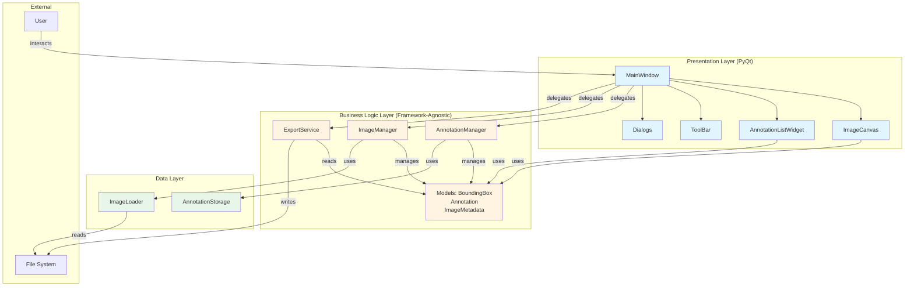
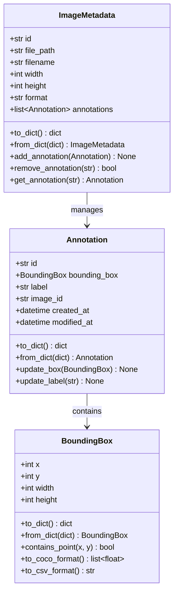
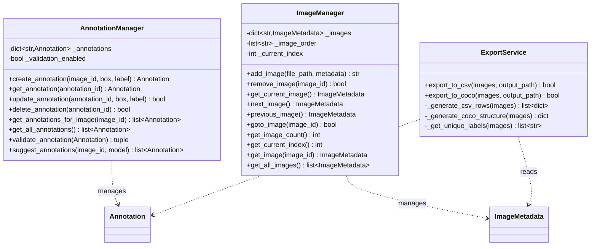
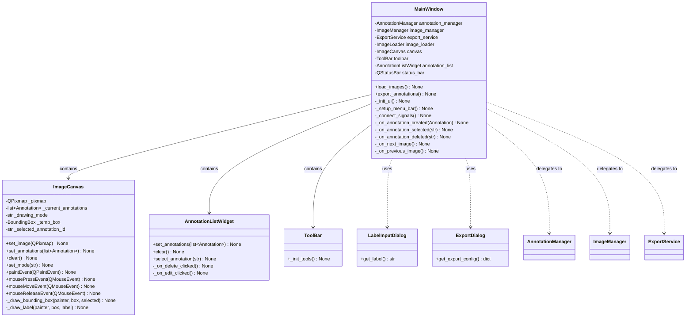
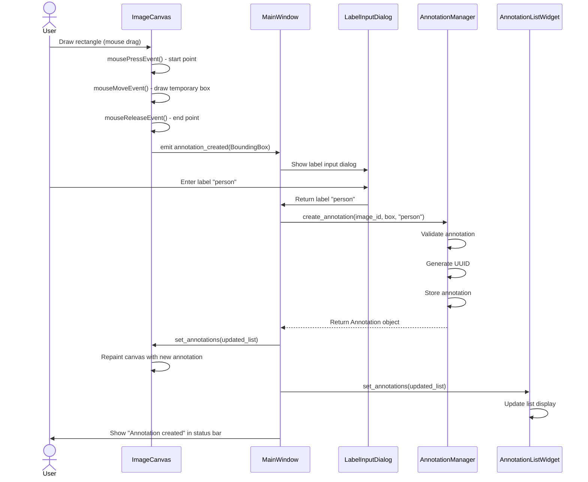
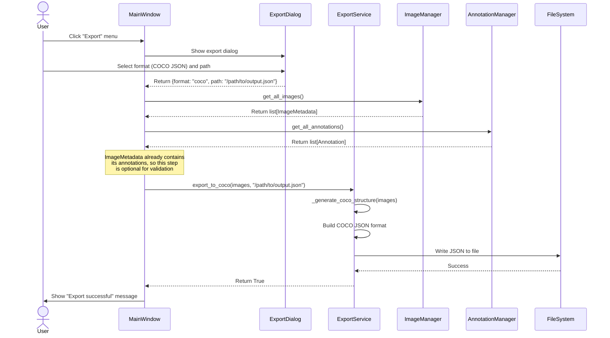
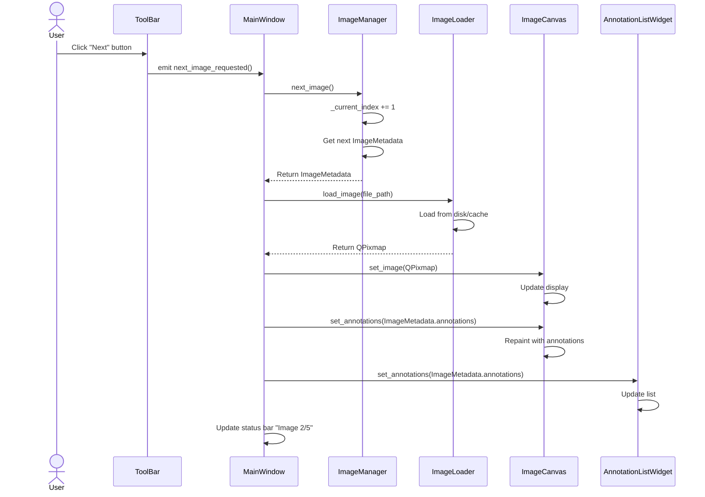
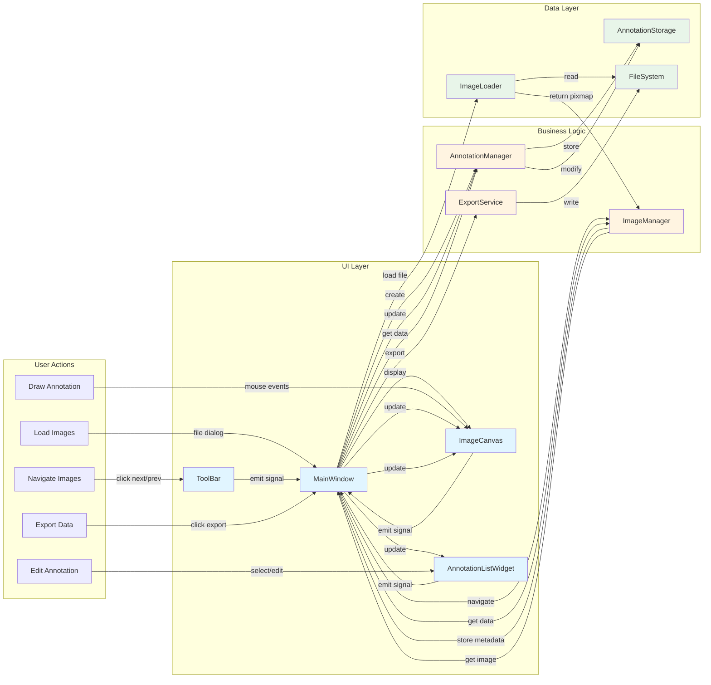
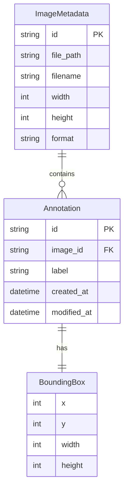
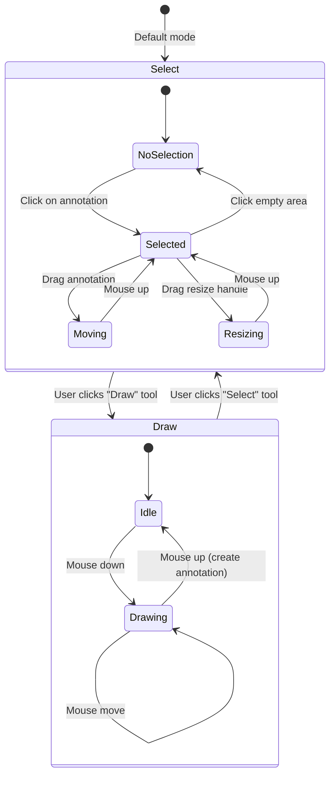

# Image Annotation Software - Implementation Plan

## Executive Summary

This document provides a comprehensive implementation plan for a PyQt-based image annotation software with clean architecture that supports future ML model integration and web deployment.

**Timeline**: 1-hour MVP
**Language**: Python 3.10+
**UI Framework**: PyQt6
**Architecture**: Three-layer design (UI → Business Logic → Data)

---

## Table of Contents

1. [Architecture Overview](#architecture-overview)
2. [System Design Diagrams](#system-design-diagrams)
3. [Project Structure](#project-structure)
4. [Class Designs](#class-designs)
5. [Implementation Sequence](#implementation-sequence)
6. [Dependencies](#dependencies)
7. [Future Extensibility](#future-extensibility)
8. [Code Quality Standards](#code-quality-standards)

---

## Architecture Overview

### Three-Layer Architecture

The system is designed with strict separation of concerns to enable future extensibility:

```
┌─────────────────────────────────────────────────────────────┐
│                    PRESENTATION LAYER                        │
│              (PyQt UI - Replaceable for Web)                 │
│  - MainWindow, ImageCanvas, ToolBar, AnnotationListWidget   │
└──────────────────────┬──────────────────────────────────────┘
                       │ (calls methods, receives events)
┌──────────────────────▼──────────────────────────────────────┐
│                   BUSINESS LOGIC LAYER                       │
│              (Framework-Agnostic Core Logic)                 │
│  - AnnotationManager, ImageManager, ExportService            │
│  - Domain Models: Image, Annotation, BoundingBox            │
└──────────────────────┬──────────────────────────────────────┘
                       │ (reads/writes data)
┌──────────────────────▼──────────────────────────────────────┐
│                      DATA LAYER                              │
│              (Persistence & File I/O)                        │
│  - ImageLoader, AnnotationStorage, ExportWriter             │
└─────────────────────────────────────────────────────────────┘
```

### Key Design Principles

1. **UI Independence**: Business logic has ZERO PyQt dependencies
2. **Future ML Ready**: Clean integration points for SAM/DINO models
3. **Web Migration Ready**: Business logic can be wrapped with REST API (FastAPI)
4. **Single Responsibility**: Each class has one clear purpose
5. **Testability**: Core logic fully testable without UI

---

## System Design Diagrams

### 1. Overall System Architecture



### 2. Class Diagram - Core Models



### 3. Class Diagram - Business Logic Layer



### 4. Class Diagram - UI Layer



### 5. Sequence Diagram - Create Annotation Workflow



### 6. Sequence Diagram - Export Workflow



### 7. Sequence Diagram - Navigate Between Images



### 8. Component Interaction Diagram



### 9. Data Model Relationships



### 10. State Machine - Drawing Mode



---

## Project Structure

### Directory Layout

```
/Users/aloksh/Documents/sandbox/image_annotate/
├── app.py                          # Entry point (PyQt application setup)
├── requirements.txt                # Project dependencies
│
├── core/                           # Business Logic Layer (Framework-Agnostic)
│   ├── __init__.py
│   ├── models.py                   # Domain models: Image, Annotation, BoundingBox
│   ├── annotation_manager.py      # Core annotation business logic
│   ├── image_manager.py           # Image handling and navigation
│   └── export_service.py          # Export logic (CSV, COCO JSON)
│
├── data/                           # Data Layer (Persistence)
│   ├── __init__.py
│   ├── image_loader.py            # Image file loading/caching
│   ├── annotation_storage.py     # In-memory annotation storage
│   └── export_writer.py          # File writing utilities
│
├── ui/                             # Presentation Layer (PyQt-specific)
│   ├── __init__.py
│   ├── main_window.py             # Main application window
│   ├── image_canvas.py            # Interactive image display & drawing
│   ├── annotation_list_widget.py  # List of annotations with edit/delete
│   ├── toolbar.py                 # Tool selection (rectangle, select, etc.)
│   └── dialogs.py                 # Label input, export dialogs
│
└── utils/                          # Shared utilities
    ├── __init__.py
    ├── constants.py               # App-wide constants
    └── validators.py              # Input validation utilities
```

---

## Class Designs

### Core Layer (`core/models.py`)

**Purpose**: Framework-agnostic domain models that can be used by both desktop and web versions.

```python
class BoundingBox:
    """Represents a rectangular bounding box."""

    Attributes:
        - x: int (top-left x coordinate)
        - y: int (top-left y coordinate)
        - width: int
        - height: int

    Methods:
        - to_dict() -> dict  # For JSON serialization
        - from_dict(data: dict) -> BoundingBox
        - contains_point(x: int, y: int) -> bool
        - to_coco_format() -> list[float]  # [x, y, width, height]
        - to_csv_format() -> str  # "x,y,width,height"


class Annotation:
    """Single annotation on an image."""

    Attributes:
        - id: str (UUID)
        - bounding_box: BoundingBox
        - label: str
        - image_id: str (reference to parent image)
        - created_at: datetime
        - modified_at: datetime

    Methods:
        - to_dict() -> dict
        - from_dict(data: dict) -> Annotation
        - update_box(box: BoundingBox) -> None
        - update_label(label: str) -> None


class ImageMetadata:
    """Image information without pixel data."""

    Attributes:
        - id: str (UUID)
        - file_path: str (absolute path)
        - filename: str
        - width: int
        - height: int
        - format: str (JPEG, PNG)
        - annotations: list[Annotation]

    Methods:
        - to_dict() -> dict
        - from_dict(data: dict) -> ImageMetadata
        - add_annotation(annotation: Annotation) -> None
        - remove_annotation(annotation_id: str) -> bool
        - get_annotation(annotation_id: str) -> Annotation | None
```

### Core Layer (`core/annotation_manager.py`)

**Purpose**: Business logic for annotation operations (framework-agnostic).

```python
class AnnotationManager:
    """
    Central business logic for managing annotations.
    Framework-agnostic - can be used with PyQt, web API, or CLI.

    FUTURE EXTENSIBILITY:
    - add_auto_annotation() method for ML model integration
    - validate_annotation() hook for custom validation rules
    """

    Attributes:
        - _annotations: dict[str, Annotation]  # annotation_id -> Annotation
        - _validation_enabled: bool

    Methods:
        # Core CRUD operations
        - create_annotation(image_id: str, box: BoundingBox, label: str) -> Annotation
        - get_annotation(annotation_id: str) -> Annotation | None
        - update_annotation(annotation_id: str, box: BoundingBox = None, label: str = None) -> bool
        - delete_annotation(annotation_id: str) -> bool

        # Query operations
        - get_annotations_for_image(image_id: str) -> list[Annotation]
        - get_all_annotations() -> list[Annotation]

        # Validation
        - validate_annotation(annotation: Annotation) -> tuple[bool, str]

        # Future ML integration point
        - suggest_annotations(image_id: str, model_name: str) -> list[Annotation]
            # Placeholder for SAM/DINO integration
```

### Core Layer (`core/image_manager.py`)

**Purpose**: Manage image collection and navigation.

```python
class ImageManager:
    """
    Manages loaded images and navigation between them.
    Framework-agnostic business logic.
    """

    Attributes:
        - _images: dict[str, ImageMetadata]  # image_id -> metadata
        - _image_order: list[str]  # Ordered list of image IDs
        - _current_index: int

    Methods:
        # Image loading
        - add_image(file_path: str, metadata: ImageMetadata) -> str  # Returns image_id
        - remove_image(image_id: str) -> bool

        # Navigation
        - get_current_image() -> ImageMetadata | None
        - next_image() -> ImageMetadata | None
        - previous_image() -> ImageMetadata | None
        - goto_image(image_id: str) -> bool
        - get_image_count() -> int
        - get_current_index() -> int

        # Query
        - get_image(image_id: str) -> ImageMetadata | None
        - get_all_images() -> list[ImageMetadata]
```

### Core Layer (`core/export_service.py`)

**Purpose**: Framework-agnostic export logic.

```python
class ExportService:
    """
    Handles export of annotations to various formats.
    Framework-agnostic - works with any UI or API.
    """

    Methods:
        # CSV Export
        - export_to_csv(images: list[ImageMetadata], output_path: str) -> bool
            # Format: image_name, x, y, width, height, label

        # COCO JSON Export
        - export_to_coco(images: list[ImageMetadata], output_path: str) -> bool
            # Standard COCO format with images, annotations, categories

        # Helper methods
        - _generate_csv_rows(images: list[ImageMetadata]) -> list[dict]
        - _generate_coco_structure(images: list[ImageMetadata]) -> dict
        - _get_unique_labels(images: list[ImageMetadata]) -> list[str]
```

**COCO JSON Structure:**

```json
{
  "images": [
    {"id": 1, "file_name": "image1.jpg", "width": 1920, "height": 1080}
  ],
  "annotations": [
    {"id": 1, "image_id": 1, "category_id": 1, "bbox": [100, 200, 50, 75]}
  ],
  "categories": [
    {"id": 1, "name": "person"}
  ]
}
```

### Data Layer (`data/image_loader.py`)

**Purpose**: Handle actual image file I/O and pixel data.

```python
class ImageLoader:
    """
    Loads image files and manages pixel data caching.
    Separated from business logic for clean architecture.
    """

    Attributes:
        - _cache: dict[str, QPixmap]  # image_id -> cached pixmap (optional)
        - _cache_size_limit: int

    Methods:
        - load_image(file_path: str) -> tuple[QPixmap, ImageMetadata]
            # Returns both pixel data and metadata

        - validate_file(file_path: str) -> bool
            # Check if file exists and is valid image format

        - get_supported_formats() -> list[str]
            # Returns ['.jpg', '.jpeg', '.png']

        - clear_cache() -> None
```

### UI Layer (`ui/main_window.py`)

**Purpose**: Main PyQt window that orchestrates UI components.

```python
class MainWindow(QMainWindow):
    """
    Main application window.
    Coordinates UI components and delegates business logic to core layer.
    """

    Attributes:
        - annotation_manager: AnnotationManager  # Business logic
        - image_manager: ImageManager  # Business logic
        - export_service: ExportService  # Business logic
        - image_loader: ImageLoader  # Data layer

        # UI Components
        - canvas: ImageCanvas
        - toolbar: ToolBar
        - annotation_list: AnnotationListWidget
        - status_bar: QStatusBar

    Methods:
        # Setup
        - _init_ui() -> None
        - _setup_menu_bar() -> None
        - _connect_signals() -> None

        # File operations (delegates to managers)
        - load_images() -> None  # Opens file dialog, calls image_manager
        - export_annotations() -> None  # Opens dialog, calls export_service

        # Event handlers
        - _on_annotation_created(annotation: Annotation) -> None
        - _on_annotation_selected(annotation_id: str) -> None
        - _on_annotation_deleted(annotation_id: str) -> None
        - _on_next_image() -> None
        - _on_previous_image() -> None
```

### UI Layer (`ui/image_canvas.py`)

**Purpose**: Interactive canvas for displaying images and drawing annotations.

```python
class ImageCanvas(QWidget):
    """
    Custom widget for image display and interactive annotation drawing.
    Emits signals for user actions, delegates business logic to AnnotationManager.
    """

    Signals:
        - annotation_created: Signal(BoundingBox, str)  # box, label
        - annotation_selected: Signal(str)  # annotation_id
        - annotation_moved: Signal(str, BoundingBox)  # annotation_id, new_box

    Attributes:
        - _pixmap: QPixmap  # Current image
        - _current_annotations: list[Annotation]  # Annotations for current image
        - _drawing_mode: str  # 'draw', 'select', 'edit'
        - _temp_box: BoundingBox | None  # Box being drawn
        - _selected_annotation_id: str | None

    Methods:
        # Display
        - set_image(pixmap: QPixmap) -> None
        - set_annotations(annotations: list[Annotation]) -> None
        - clear() -> None

        # Drawing state
        - set_mode(mode: str) -> None  # 'draw', 'select', 'edit'

        # Event handlers
        - paintEvent(event: QPaintEvent) -> None
            # Renders image + all bounding boxes
        - mousePressEvent(event: QMouseEvent) -> None
        - mouseMoveEvent(event: QMouseEvent) -> None
        - mouseReleaseEvent(event: QMouseEvent) -> None

        # Rendering helpers
        - _draw_bounding_box(painter: QPainter, box: BoundingBox, selected: bool) -> None
        - _draw_label(painter: QPainter, box: BoundingBox, label: str) -> None
```

### UI Layer (`ui/annotation_list_widget.py`)

**Purpose**: Display and manage list of annotations.

```python
class AnnotationListWidget(QWidget):
    """
    List widget showing all annotations for current image.
    Allows selection, editing, deletion.
    """

    Signals:
        - annotation_selected: Signal(str)  # annotation_id
        - annotation_deleted: Signal(str)  # annotation_id
        - annotation_edited: Signal(str, str)  # annotation_id, new_label

    Methods:
        - set_annotations(annotations: list[Annotation]) -> None
        - clear() -> None
        - select_annotation(annotation_id: str) -> None
        - _on_delete_clicked() -> None
        - _on_edit_clicked() -> None
```

### UI Layer (`ui/toolbar.py`)

**Purpose**: Tool selection and actions.

```python
class ToolBar(QToolBar):
    """
    Main toolbar with drawing tools and actions.
    """

    Signals:
        - mode_changed: Signal(str)  # 'draw', 'select', 'edit'
        - next_image_requested: Signal()
        - previous_image_requested: Signal()

    Methods:
        - _init_tools() -> None
            # Creates buttons for: Draw, Select, Next, Previous
```

### UI Layer (`ui/dialogs.py`)

**Purpose**: Dialog windows for user input.

```python
class LabelInputDialog(QDialog):
    """Simple dialog to input annotation label."""
    Methods:
        - get_label() -> str | None

class ExportDialog(QDialog):
    """Dialog for export options (format, path)."""
    Methods:
        - get_export_config() -> dict  # {format: 'csv'|'coco', path: str}
```

---

## Implementation Sequence

### Phase 1: Foundation (15 minutes)

**Goal**: Establish data models and business logic skeleton.

#### Step 1.1: Project Setup (3 min)

**Files to create:**
- All directories: `core/`, `data/`, `ui/`, `utils/`
- All `__init__.py` files
- `requirements.txt`

**Requirements.txt content:**
```
PyQt6>=6.4.0
Pillow>=9.5.0
```

#### Step 1.2: Core Models (7 min)

**File**: [core/models.py](core/models.py)

Implement in order:
1. `BoundingBox` class - Simple data class with x, y, width, height
2. `Annotation` class - Uses BoundingBox, adds label and metadata
3. `ImageMetadata` class - Contains list of Annotations

**Key implementation notes:**
- Use `@dataclass` decorator for clean code
- Add `to_dict()` and `from_dict()` for serialization
- Use `uuid.uuid4()` for generating IDs

#### Step 1.3: Core Managers (5 min)

**File**: [core/annotation_manager.py](core/annotation_manager.py)

Implement basic CRUD:
- `create_annotation()` - Generate UUID, store in dict
- `get_annotations_for_image()` - Filter by image_id
- `delete_annotation()` - Remove from dict

**File**: [core/image_manager.py](core/image_manager.py)

Implement basic navigation:
- `add_image()` - Store metadata, maintain order
- `get_current_image()` - Return current
- `next_image()` / `previous_image()` - Navigate with index

**Deliverable**: Foundation layer with data models and business logic skeleton.

---

### Phase 2: Data Layer (10 minutes)

**Goal**: Enable loading and validating image files.

#### Step 2.1: Image Loading (7 min)

**File**: [data/image_loader.py](data/image_loader.py)

Implement:
- `load_image()` - Use PyQt6's QPixmap to load image
- `validate_file()` - Check file exists and has valid extension
- Extract metadata (width, height, format) from loaded image

**Key implementation notes:**
```python
from PyQt6.QtGui import QPixmap, QImageReader

pixmap = QPixmap(file_path)
if pixmap.isNull():
    raise ValueError("Invalid image file")

width = pixmap.width()
height = pixmap.height()
```

#### Step 2.2: Constants (3 min)

**File**: [utils/constants.py](utils/constants.py)

Define:
```python
SUPPORTED_FORMATS = ['.jpg', '.jpeg', '.png']
DEFAULT_BOX_COLOR = '#00FF00'
SELECTED_BOX_COLOR = '#FF0000'
BOX_LINE_WIDTH = 2
```

**Deliverable**: Can load and validate image files.

---

### Phase 3: Basic UI (20 minutes)

**Goal**: Working UI that can load images, draw rectangles, and assign labels.

#### Step 3.1: Main Window Structure (5 min)

**File**: [ui/main_window.py](ui/main_window.py)

Implement:
- Basic `QMainWindow` setup
- Menu bar with "File" → "Load Images" action
- Status bar
- Initialize business logic managers (AnnotationManager, ImageManager, etc.)

**Layout**:
```python
# Central widget with layout
central_widget = QWidget()
layout = QVBoxLayout()

# Will add canvas and annotation list later
central_widget.setLayout(layout)
self.setCentralWidget(central_widget)
```

#### Step 3.2: Image Canvas - Display Only (7 min)

**File**: [ui/image_canvas.py](ui/image_canvas.py)

Implement (display-only first):
- `set_image()` - Store QPixmap
- `paintEvent()` - Draw image scaled to fit widget
- Basic layout and sizing

**Key implementation notes:**
```python
def paintEvent(self, event):
    painter = QPainter(self)
    if self._pixmap:
        # Scale pixmap to fit widget while maintaining aspect ratio
        scaled = self._pixmap.scaled(
            self.size(),
            Qt.AspectRatioMode.KeepAspectRatio,
            Qt.TransformationMode.SmoothTransformation
        )
        painter.drawPixmap(0, 0, scaled)
```

#### Step 3.3: Wire Load Images (3 min)

**In**: [ui/main_window.py](ui/main_window.py)

Implement `load_images()`:
```python
def load_images(self):
    file_paths, _ = QFileDialog.getOpenFileNames(
        self,
        "Select Images",
        "",
        "Images (*.jpg *.jpeg *.png)"
    )

    for path in file_paths:
        pixmap, metadata = self.image_loader.load_image(path)
        image_id = self.image_manager.add_image(path, metadata)

    # Display first image
    current = self.image_manager.get_current_image()
    if current:
        pixmap, _ = self.image_loader.load_image(current.file_path)
        self.canvas.set_image(pixmap)
```

**Test**: Should be able to load and display an image!

#### Step 3.4: Image Canvas - Drawing (5 min)

**In**: [ui/image_canvas.py](ui/image_canvas.py)

Implement mouse events:
```python
def mousePressEvent(self, event):
    if self._drawing_mode == 'draw':
        self._start_point = event.pos()

def mouseMoveEvent(self, event):
    if self._drawing_mode == 'draw' and self._start_point:
        self._temp_box = BoundingBox(
            x=self._start_point.x(),
            y=self._start_point.y(),
            width=event.pos().x() - self._start_point.x(),
            height=event.pos().y() - self._start_point.y()
        )
        self.update()  # Trigger repaint

def mouseReleaseEvent(self, event):
    if self._drawing_mode == 'draw' and self._temp_box:
        self.annotation_created.emit(self._temp_box)
        self._temp_box = None
```

Update `paintEvent()` to draw temporary box and existing annotations.

#### Step 3.5: Label Dialog (3 min)

**File**: [ui/dialogs.py](ui/dialogs.py)

Simple implementation:
```python
class LabelInputDialog(QDialog):
    def __init__(self, parent=None):
        super().__init__(parent)
        self.setWindowTitle("Enter Label")

        layout = QVBoxLayout()
        self.input = QLineEdit()
        layout.addWidget(QLabel("Annotation Label:"))
        layout.addWidget(self.input)

        buttons = QDialogButtonBox(
            QDialogButtonBox.StandardButton.Ok |
            QDialogButtonBox.StandardButton.Cancel
        )
        buttons.accepted.connect(self.accept)
        buttons.rejected.connect(self.reject)
        layout.addWidget(buttons)

        self.setLayout(layout)

    def get_label(self):
        return self.input.text() if self.result() else None
```

#### Step 3.6: Wire Annotation Creation (2 min)

**In**: [ui/main_window.py](ui/main_window.py)

Connect canvas signal:
```python
def _connect_signals(self):
    self.canvas.annotation_created.connect(self._on_annotation_created)

def _on_annotation_created(self, box: BoundingBox):
    dialog = LabelInputDialog(self)
    if dialog.exec():
        label = dialog.get_label()
        if label:
            current_image = self.image_manager.get_current_image()
            annotation = self.annotation_manager.create_annotation(
                current_image.id, box, label
            )
            current_image.add_annotation(annotation)
            self.canvas.set_annotations(current_image.annotations)
            self.status_bar.showMessage(f"Created annotation: {label}")
```

#### Step 3.7: Entry Point (2 min)

**File**: [app.py](app.py)

```python
import sys
from PyQt6.QtWidgets import QApplication
from ui.main_window import MainWindow

def main():
    app = QApplication(sys.argv)
    window = MainWindow()
    window.setWindowTitle("Image Annotation Tool")
    window.resize(1200, 800)
    window.show()
    sys.exit(app.exec())

if __name__ == "__main__":
    main()
```

**Deliverable**: Can load image, draw rectangles, assign labels!

---

### Phase 4: Navigation & List (10 minutes)

**Goal**: Navigate between images and manage annotations.

#### Step 4.1: Annotation List Widget (5 min)

**File**: [ui/annotation_list_widget.py](ui/annotation_list_widget.py)

```python
class AnnotationListWidget(QWidget):
    annotation_deleted = pyqtSignal(str)  # annotation_id

    def __init__(self):
        super().__init__()
        layout = QVBoxLayout()

        self.list_widget = QListWidget()
        self.delete_btn = QPushButton("Delete Selected")
        self.delete_btn.clicked.connect(self._on_delete_clicked)

        layout.addWidget(QLabel("Annotations:"))
        layout.addWidget(self.list_widget)
        layout.addWidget(self.delete_btn)
        self.setLayout(layout)

    def set_annotations(self, annotations):
        self.list_widget.clear()
        for ann in annotations:
            item = QListWidgetItem(f"{ann.label} - {ann.id[:8]}")
            item.setData(Qt.ItemDataRole.UserRole, ann.id)
            self.list_widget.addItem(item)

    def _on_delete_clicked(self):
        current = self.list_widget.currentItem()
        if current:
            annotation_id = current.data(Qt.ItemDataRole.UserRole)
            self.annotation_deleted.emit(annotation_id)
```

#### Step 4.2: Toolbar (3 min)

**File**: [ui/toolbar.py](ui/toolbar.py)

```python
class ToolBar(QToolBar):
    next_image_requested = pyqtSignal()
    previous_image_requested = pyqtSignal()

    def __init__(self):
        super().__init__()

        self.prev_btn = QPushButton("← Previous")
        self.next_btn = QPushButton("Next →")

        self.prev_btn.clicked.connect(self.previous_image_requested.emit)
        self.next_btn.clicked.connect(self.next_image_requested.emit)

        self.addWidget(self.prev_btn)
        self.addWidget(self.next_btn)
```

#### Step 4.3: Wire Navigation in MainWindow (2 min)

**In**: [ui/main_window.py](ui/main_window.py)

Add toolbar and annotation list to layout:
```python
def _init_ui(self):
    # ... existing code ...

    self.toolbar = ToolBar()
    self.addToolBar(self.toolbar)

    self.annotation_list = AnnotationListWidget()

    # Layout: canvas on left, annotation list on right
    main_layout = QHBoxLayout()
    main_layout.addWidget(self.canvas, stretch=3)
    main_layout.addWidget(self.annotation_list, stretch=1)
```

Connect signals:
```python
def _connect_signals(self):
    # ... existing ...
    self.toolbar.next_image_requested.connect(self._on_next_image)
    self.toolbar.previous_image_requested.connect(self._on_previous_image)
    self.annotation_list.annotation_deleted.connect(self._on_annotation_deleted)

def _on_next_image(self):
    next_img = self.image_manager.next_image()
    if next_img:
        self._display_image(next_img)

def _on_previous_image(self):
    prev_img = self.image_manager.previous_image()
    if prev_img:
        self._display_image(prev_img)

def _display_image(self, image_metadata):
    pixmap, _ = self.image_loader.load_image(image_metadata.file_path)
    self.canvas.set_image(pixmap)
    self.canvas.set_annotations(image_metadata.annotations)
    self.annotation_list.set_annotations(image_metadata.annotations)

    idx = self.image_manager.get_current_index()
    total = self.image_manager.get_image_count()
    self.status_bar.showMessage(f"Image {idx+1}/{total}")

def _on_annotation_deleted(self, annotation_id):
    current_image = self.image_manager.get_current_image()
    current_image.remove_annotation(annotation_id)
    self.annotation_manager.delete_annotation(annotation_id)
    self._display_image(current_image)  # Refresh
```

**Deliverable**: Can navigate between images and delete annotations!

---

### Phase 5: Export (5 minutes)

**Goal**: Export annotations to CSV and COCO JSON.

#### Step 5.1: Export Service (10 min)

**File**: [core/export_service.py](core/export_service.py)

Implement CSV export:
```python
import csv
import json
from pathlib import Path

class ExportService:
    def export_to_csv(self, images: list, output_path: str) -> bool:
        try:
            with open(output_path, 'w', newline='') as f:
                writer = csv.writer(f)
                writer.writerow(['image_name', 'x', 'y', 'width', 'height', 'label'])

                for image in images:
                    for ann in image.annotations:
                        writer.writerow([
                            image.filename,
                            ann.bounding_box.x,
                            ann.bounding_box.y,
                            ann.bounding_box.width,
                            ann.bounding_box.height,
                            ann.label
                        ])
            return True
        except Exception as e:
            print(f"CSV export error: {e}")
            return False
```

Implement COCO JSON export:
```python
def export_to_coco(self, images: list, output_path: str) -> bool:
    try:
        # Get unique labels for categories
        labels = self._get_unique_labels(images)
        categories = [
            {"id": idx+1, "name": label}
            for idx, label in enumerate(labels)
        ]
        label_to_id = {label: idx+1 for idx, label in enumerate(labels)}

        # Build COCO structure
        coco_data = {
            "images": [],
            "annotations": [],
            "categories": categories
        }

        annotation_id = 1
        for img_idx, image in enumerate(images, start=1):
            # Add image info
            coco_data["images"].append({
                "id": img_idx,
                "file_name": image.filename,
                "width": image.width,
                "height": image.height
            })

            # Add annotations
            for ann in image.annotations:
                coco_data["annotations"].append({
                    "id": annotation_id,
                    "image_id": img_idx,
                    "category_id": label_to_id[ann.label],
                    "bbox": [
                        ann.bounding_box.x,
                        ann.bounding_box.y,
                        ann.bounding_box.width,
                        ann.bounding_box.height
                    ],
                    "area": ann.bounding_box.width * ann.bounding_box.height,
                    "iscrowd": 0
                })
                annotation_id += 1

        with open(output_path, 'w') as f:
            json.dump(coco_data, f, indent=2)

        return True
    except Exception as e:
        print(f"COCO export error: {e}")
        return False

def _get_unique_labels(self, images: list) -> list:
    labels = set()
    for image in images:
        for ann in image.annotations:
            labels.add(ann.label)
    return sorted(list(labels))
```

#### Step 5.2: Export Dialog (2 min)

**In**: [ui/dialogs.py](ui/dialogs.py)

```python
class ExportDialog(QDialog):
    def __init__(self, parent=None):
        super().__init__(parent)
        self.setWindowTitle("Export Annotations")

        layout = QVBoxLayout()

        # Format selection
        self.format_combo = QComboBox()
        self.format_combo.addItems(["CSV", "COCO JSON"])
        layout.addWidget(QLabel("Export Format:"))
        layout.addWidget(self.format_combo)

        # Path selection
        self.path_input = QLineEdit()
        browse_btn = QPushButton("Browse...")
        browse_btn.clicked.connect(self._browse)

        path_layout = QHBoxLayout()
        path_layout.addWidget(self.path_input)
        path_layout.addWidget(browse_btn)

        layout.addWidget(QLabel("Output File:"))
        layout.addLayout(path_layout)

        # Buttons
        buttons = QDialogButtonBox(
            QDialogButtonBox.StandardButton.Ok |
            QDialogButtonBox.StandardButton.Cancel
        )
        buttons.accepted.connect(self.accept)
        buttons.rejected.connect(self.reject)
        layout.addWidget(buttons)

        self.setLayout(layout)

    def _browse(self):
        file_path, _ = QFileDialog.getSaveFileName(
            self,
            "Save Annotations",
            "",
            "CSV Files (*.csv);;JSON Files (*.json)"
        )
        if file_path:
            self.path_input.setText(file_path)

    def get_export_config(self):
        if self.result():
            return {
                'format': self.format_combo.currentText(),
                'path': self.path_input.text()
            }
        return None
```

#### Step 5.3: Wire Export in MainWindow (1 min)

**In**: [ui/main_window.py](ui/main_window.py)

Add menu action:
```python
def _setup_menu_bar(self):
    menubar = self.menuBar()
    file_menu = menubar.addMenu("File")

    load_action = file_menu.addAction("Load Images")
    load_action.triggered.connect(self.load_images)

    export_action = file_menu.addAction("Export Annotations")
    export_action.triggered.connect(self.export_annotations)
```

Implement export:
```python
def export_annotations(self):
    dialog = ExportDialog(self)
    config = dialog.get_export_config()

    if config:
        images = self.image_manager.get_all_images()

        if config['format'] == 'CSV':
            success = self.export_service.export_to_csv(images, config['path'])
        else:  # COCO JSON
            success = self.export_service.export_to_coco(images, config['path'])

        if success:
            self.status_bar.showMessage(f"Exported to {config['path']}")
        else:
            self.status_bar.showMessage("Export failed!")
```

**Deliverable**: FULL MVP - Can annotate images and export to CSV/COCO JSON!

---

## Dependencies

### requirements.txt

```
PyQt6>=6.4.0          # UI framework (GPL with exceptions - free for open source)
Pillow>=9.5.0         # Image loading fallback (MIT-like license)
```

**Installation:**
```bash
pip install -r requirements.txt
```

**License Compatibility**: Both libraries use permissive licenses suitable for open-source and commercial projects.

---

## Future Extensibility

### 1. ML Model Integration (SAM, DINO)

**Integration Point**: [core/annotation_manager.py](core/annotation_manager.py)

```python
class AnnotationManager:
    def suggest_annotations(
        self,
        image_id: str,
        model: str = 'sam'
    ) -> list[Annotation]:
        """
        Generate automatic annotation suggestions using ML models.

        Future implementation steps:
        1. Get image pixel data from ImageManager
        2. Load model (SAM/DINO) - lazy loading to avoid startup cost
        3. Run inference on image
        4. Convert model output (masks/boxes) to Annotation objects
        5. Return suggestions (user can accept/reject in UI)

        Args:
            image_id: ID of image to annotate
            model: 'sam' (Segment Anything) or 'dino' (Detection Transformer)

        Returns:
            List of suggested Annotation objects
        """
        image_metadata = self._get_image_metadata(image_id)

        if model == 'sam':
            return self._suggest_with_sam(image_metadata)
        elif model == 'dino':
            return self._suggest_with_dino(image_metadata)
        else:
            raise ValueError(f"Unknown model: {model}")

    def _suggest_with_sam(self, image_metadata):
        """
        Future: Load SAM model and generate segmentation masks.

        Pseudo-code:
        1. from segment_anything import sam_model_registry, SamAutomaticMaskGenerator
        2. sam = sam_model_registry["vit_h"](checkpoint="sam_vit_h.pth")
        3. mask_generator = SamAutomaticMaskGenerator(sam)
        4. masks = mask_generator.generate(image_array)
        5. Convert masks to BoundingBox objects
        6. Return as Annotation objects with label="auto_detected"
        """
        # Placeholder for future implementation
        return []

    def _suggest_with_dino(self, image_metadata):
        """
        Future: Load DINO model and generate object detections.

        Pseudo-code:
        1. from transformers import DetrImageProcessor, DetrForObjectDetection
        2. processor = DetrImageProcessor.from_pretrained("facebook/detr-resnet-50")
        3. model = DetrForObjectDetection.from_pretrained("facebook/detr-resnet-50")
        4. Run inference
        5. Convert detections to BoundingBox + labels
        6. Return as Annotation objects
        """
        # Placeholder for future implementation
        return []
```

**UI Changes Needed:**

In [ui/toolbar.py](ui/toolbar.py), add:
```python
self.auto_annotate_btn = QPushButton("🤖 Auto-Annotate")
self.auto_annotate_btn.clicked.connect(self.auto_annotate_requested.emit)
```

In [ui/main_window.py](ui/main_window.py), add:
```python
def _on_auto_annotate(self):
    current_image = self.image_manager.get_current_image()

    # Show loading indicator
    self.status_bar.showMessage("Running auto-annotation...")

    # Get suggestions from ML model
    suggestions = self.annotation_manager.suggest_annotations(
        current_image.id,
        model='sam'  # or 'dino'
    )

    # Display suggestions in different color (e.g., orange instead of green)
    self.canvas.set_suggested_annotations(suggestions)

    # User can accept/reject each suggestion
    self.status_bar.showMessage(f"Found {len(suggestions)} suggestions")
```

**No Refactoring Required**: Business logic is already isolated, just add new methods!

---

### 2. Web API Deployment (FastAPI)

**Integration Point**: New `api/` module wraps existing core layer.

**Directory structure:**
```
api/
├── __init__.py
├── main.py              # FastAPI app
├── routes.py            # API endpoints
└── schemas.py           # Pydantic models for API
```

**File**: `api/main.py`

```python
from fastapi import FastAPI, UploadFile, File, HTTPException
from fastapi.middleware.cors import CORSMiddleware
from core.annotation_manager import AnnotationManager
from core.image_manager import ImageManager
from core.export_service import ExportService
from core.models import BoundingBox, Annotation
from api.schemas import AnnotationCreate, AnnotationUpdate

# Initialize app and business logic (same as desktop app!)
app = FastAPI(title="Image Annotation API")
annotation_manager = AnnotationManager()
image_manager = ImageManager()
export_service = ExportService()

# Enable CORS for web frontend
app.add_middleware(
    CORSMiddleware,
    allow_origins=["*"],
    allow_methods=["*"],
    allow_headers=["*"],
)

# API Endpoints - all reuse existing business logic

@app.post("/api/images")
async def upload_image(file: UploadFile = File(...)):
    """Upload an image file."""
    # Save file temporarily
    file_path = f"/tmp/{file.filename}"
    with open(file_path, "wb") as f:
        f.write(await file.read())

    # Use existing ImageLoader (same as desktop!)
    from data.image_loader import ImageLoader
    loader = ImageLoader()
    _, metadata = loader.load_image(file_path)

    # Use existing ImageManager (same as desktop!)
    image_id = image_manager.add_image(file_path, metadata)

    return {"image_id": image_id, "filename": file.filename}

@app.get("/api/images")
async def list_images():
    """Get all loaded images."""
    images = image_manager.get_all_images()
    return [img.to_dict() for img in images]

@app.get("/api/images/{image_id}")
async def get_image(image_id: str):
    """Get specific image metadata."""
    image = image_manager.get_image(image_id)
    if not image:
        raise HTTPException(status_code=404, detail="Image not found")
    return image.to_dict()

@app.post("/api/annotations")
async def create_annotation(data: AnnotationCreate):
    """
    Create a new annotation.
    Uses EXACT SAME business logic as desktop app!
    """
    box = BoundingBox(
        x=data.bbox['x'],
        y=data.bbox['y'],
        width=data.bbox['width'],
        height=data.bbox['height']
    )

    # Same method PyQt app uses!
    annotation = annotation_manager.create_annotation(
        data.image_id,
        box,
        data.label
    )

    return annotation.to_dict()

@app.get("/api/images/{image_id}/annotations")
async def get_annotations(image_id: str):
    """Get all annotations for an image."""
    annotations = annotation_manager.get_annotations_for_image(image_id)
    return [ann.to_dict() for ann in annotations]

@app.put("/api/annotations/{annotation_id}")
async def update_annotation(annotation_id: str, data: AnnotationUpdate):
    """Update an existing annotation."""
    box = None
    if data.bbox:
        box = BoundingBox(**data.bbox)

    success = annotation_manager.update_annotation(
        annotation_id,
        box=box,
        label=data.label
    )

    if not success:
        raise HTTPException(status_code=404, detail="Annotation not found")

    return {"success": True}

@app.delete("/api/annotations/{annotation_id}")
async def delete_annotation(annotation_id: str):
    """Delete an annotation."""
    success = annotation_manager.delete_annotation(annotation_id)
    if not success:
        raise HTTPException(status_code=404, detail="Annotation not found")
    return {"success": True}

@app.post("/api/export")
async def export_annotations(format: str = "csv"):
    """
    Export all annotations.
    Uses EXACT SAME export logic as desktop app!
    """
    images = image_manager.get_all_images()
    output_path = f"/tmp/export.{format}"

    if format == "csv":
        success = export_service.export_to_csv(images, output_path)
    elif format == "coco":
        success = export_service.export_to_coco(images, output_path)
    else:
        raise HTTPException(status_code=400, detail="Invalid format")

    if not success:
        raise HTTPException(status_code=500, detail="Export failed")

    return {"download_url": f"/downloads/{output_path}"}
```

**File**: `api/schemas.py`

```python
from pydantic import BaseModel
from typing import Optional

class AnnotationCreate(BaseModel):
    image_id: str
    bbox: dict  # {x: int, y: int, width: int, height: int}
    label: str

class AnnotationUpdate(BaseModel):
    bbox: Optional[dict] = None
    label: Optional[str] = None
```

**Web Frontend (React example)**:

```javascript
// Web UI calls REST API instead of Python methods directly
// Canvas drawing logic reimplemented in JavaScript

const canvas = document.getElementById('annotation-canvas');
let startPoint = null;

canvas.addEventListener('mousedown', (e) => {
    startPoint = {x: e.offsetX, y: e.offsetY};
});

canvas.addEventListener('mouseup', async (e) => {
    if (!startPoint) return;

    const bbox = {
        x: startPoint.x,
        y: startPoint.y,
        width: e.offsetX - startPoint.x,
        height: e.offsetY - startPoint.y
    };

    const label = prompt("Enter label:");

    // Call API - same business logic as desktop!
    const response = await fetch('/api/annotations', {
        method: 'POST',
        headers: {'Content-Type': 'application/json'},
        body: JSON.stringify({
            image_id: currentImageId,
            bbox: bbox,
            label: label
        })
    });

    const annotation = await response.json();
    drawAnnotation(annotation);  // Render on canvas

    startPoint = null;
});
```

**Key Points:**
- **Zero changes to core layer** - it's already framework-agnostic!
- FastAPI wraps existing business logic with HTTP endpoints
- Web UI implements drawing in JavaScript, calls API for storage
- Same data models (JSON serialization already implemented)
- Desktop and web versions share 100% of business logic code

---

## Code Quality Standards

### PEP 8 Compliance

- **Indentation**: 4 spaces (no tabs)
- **Line length**: 88 characters (Black formatter compatible)
- **Naming conventions**:
  - Classes: `PascalCase`
  - Functions/methods: `snake_case`
  - Constants: `UPPER_SNAKE_CASE`
  - Private methods: `_leading_underscore`

### Type Hints

All function signatures must include type hints:

```python
def create_annotation(
    self,
    image_id: str,
    box: BoundingBox,
    label: str
) -> Annotation:
    """Create a new annotation."""
    pass
```

### Docstrings

All public classes and methods must have docstrings:

```python
class AnnotationManager:
    """
    Central business logic for managing annotations.

    This class is framework-agnostic and can be used with PyQt,
    web APIs, or command-line interfaces.

    Attributes:
        _annotations: Dictionary mapping annotation IDs to Annotation objects
        _validation_enabled: Whether to validate annotations before creation

    Example:
        >>> manager = AnnotationManager()
        >>> box = BoundingBox(x=100, y=200, width=50, height=75)
        >>> ann = manager.create_annotation("img_1", box, "person")
        >>> print(ann.label)
        "person"
    """
```

### Comments

- **Module-level**: Purpose of the module and key design decisions
- **Inline comments**: Only for non-obvious logic
- **TODO comments**: Mark future improvements

```python
# TODO: Add caching to avoid reloading images from disk
# TODO: Implement undo/redo functionality
```

### Error Handling

- **Validate at boundaries**: User input (UI layer), file I/O (data layer)
- **Raise specific exceptions**: `ValueError`, `FileNotFoundError`, etc.
- **Clear error messages**: Help user understand what went wrong

```python
def load_image(self, file_path: str) -> tuple[QPixmap, ImageMetadata]:
    """Load an image file."""
    if not Path(file_path).exists():
        raise FileNotFoundError(f"Image file not found: {file_path}")

    pixmap = QPixmap(file_path)
    if pixmap.isNull():
        raise ValueError(f"Invalid image file or unsupported format: {file_path}")

    # ... rest of implementation
```

### Logging (Post-MVP)

For future debugging, add Python logging:

```python
import logging

logger = logging.getLogger(__name__)

class AnnotationManager:
    def create_annotation(self, image_id: str, box: BoundingBox, label: str):
        logger.info(f"Creating annotation for image {image_id} with label '{label}'")
        # ... implementation
```

---

## Testing Strategy (Post-MVP)

### Unit Tests

Test business logic in isolation:

```python
# tests/test_annotation_manager.py
import unittest
from core.annotation_manager import AnnotationManager
from core.models import BoundingBox

class TestAnnotationManager(unittest.TestCase):
    def setUp(self):
        self.manager = AnnotationManager()

    def test_create_annotation(self):
        box = BoundingBox(x=10, y=20, width=30, height=40)
        ann = self.manager.create_annotation("img_1", box, "cat")

        self.assertEqual(ann.label, "cat")
        self.assertEqual(ann.bounding_box.x, 10)
        self.assertIsNotNone(ann.id)

    def test_get_annotations_for_image(self):
        box1 = BoundingBox(x=10, y=20, width=30, height=40)
        box2 = BoundingBox(x=50, y=60, width=70, height=80)

        self.manager.create_annotation("img_1", box1, "cat")
        self.manager.create_annotation("img_2", box2, "dog")

        img1_anns = self.manager.get_annotations_for_image("img_1")
        self.assertEqual(len(img1_anns), 1)
        self.assertEqual(img1_anns[0].label, "cat")
```

### Integration Tests

Test full workflows:

```python
# tests/test_export.py
import unittest
import json
from core.export_service import ExportService
from core.models import ImageMetadata, Annotation, BoundingBox

class TestExport(unittest.TestCase):
    def test_coco_export_format(self):
        # Create test data
        img = ImageMetadata(
            id="img_1",
            file_path="/path/to/image.jpg",
            filename="image.jpg",
            width=1920,
            height=1080,
            format="JPEG",
            annotations=[]
        )

        box = BoundingBox(x=100, y=200, width=50, height=75)
        ann = Annotation(
            id="ann_1",
            bounding_box=box,
            label="person",
            image_id="img_1"
        )
        img.add_annotation(ann)

        # Export
        service = ExportService()
        output_path = "/tmp/test_export.json"
        success = service.export_to_coco([img], output_path)

        self.assertTrue(success)

        # Validate COCO format
        with open(output_path) as f:
            data = json.load(f)

        self.assertIn("images", data)
        self.assertIn("annotations", data)
        self.assertIn("categories", data)
        self.assertEqual(len(data["images"]), 1)
        self.assertEqual(len(data["annotations"]), 1)
        self.assertEqual(data["annotations"][0]["bbox"], [100, 200, 50, 75])
```

### Manual Testing Checklist

Before release, verify:

- [ ] Load JPEG image successfully
- [ ] Load PNG image successfully
- [ ] Draw multiple annotations on one image
- [ ] Annotations persist when navigating away and back
- [ ] Edit annotation label
- [ ] Delete annotation
- [ ] Navigate between multiple images (Next/Previous)
- [ ] Export to CSV produces valid format
- [ ] Export to COCO JSON produces valid format
- [ ] Application handles 4K image without freezing
- [ ] Error handling for invalid image files
- [ ] Error handling for file write failures

---

## Summary

This implementation plan provides:

✅ **Clean Architecture**: Three-layer design (UI → Business Logic → Data)
✅ **Framework Independence**: Core logic has zero PyQt dependencies
✅ **Future ML Ready**: Clear integration point for SAM/DINO models
✅ **Future Web Ready**: Business logic can be wrapped with FastAPI
✅ **1-Hour MVP Feasible**: Incremental phases with clear deliverables
✅ **Maintainability**: Well-structured, documented, testable code
✅ **Extensibility**: Easy to add features without refactoring

### Critical Files (Implementation Priority Order)

1. **[core/models.py](core/models.py)** - Foundation data structures
2. **[core/annotation_manager.py](core/annotation_manager.py)** - Core business logic
3. **[ui/image_canvas.py](ui/image_canvas.py)** - User interaction
4. **[ui/main_window.py](ui/main_window.py)** - Integration
5. **[core/export_service.py](core/export_service.py)** - Deliverable feature

### Next Steps

1. Install dependencies: `pip install -r requirements.txt`
2. Follow implementation sequence Phase 1 → Phase 5
3. Test after each phase to catch issues early
4. Iterate based on user feedback

---

**Questions or clarifications?** Feel free to ask before starting implementation!