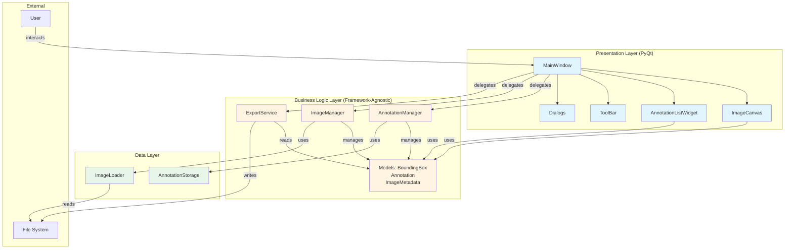
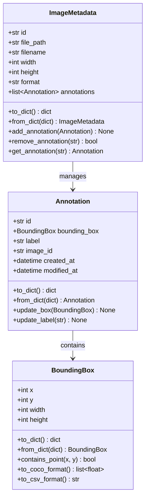
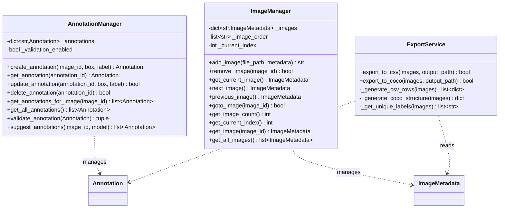
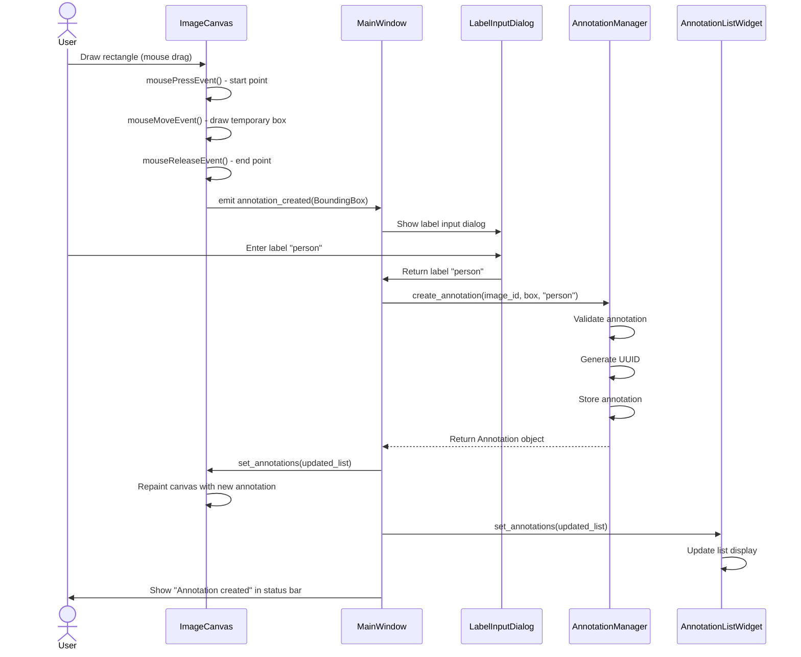
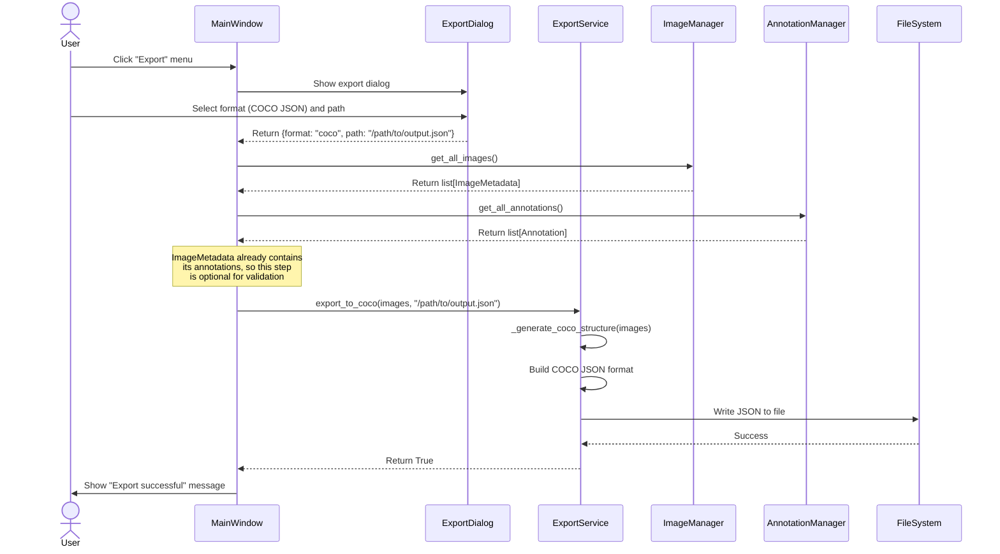
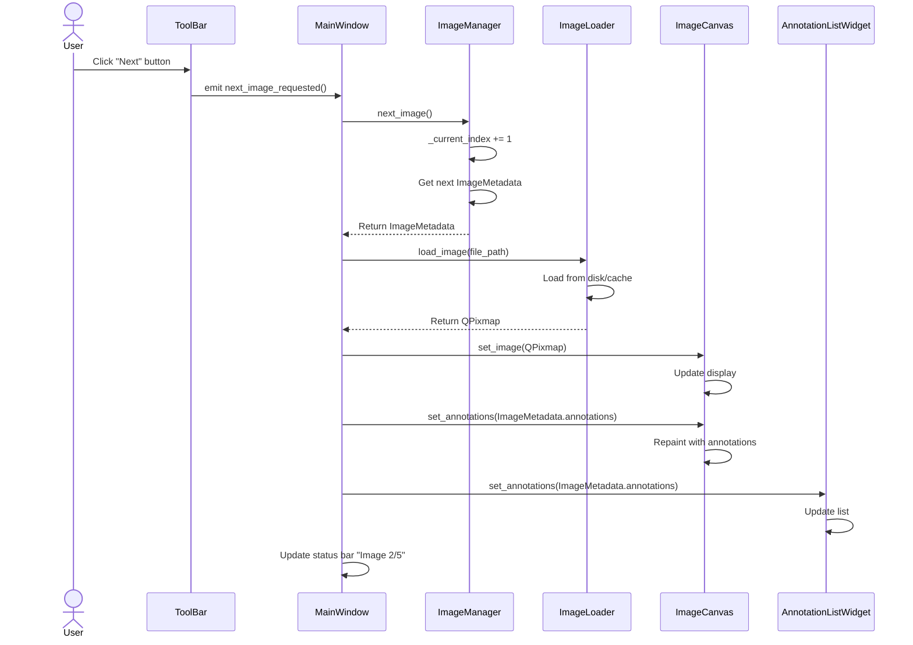
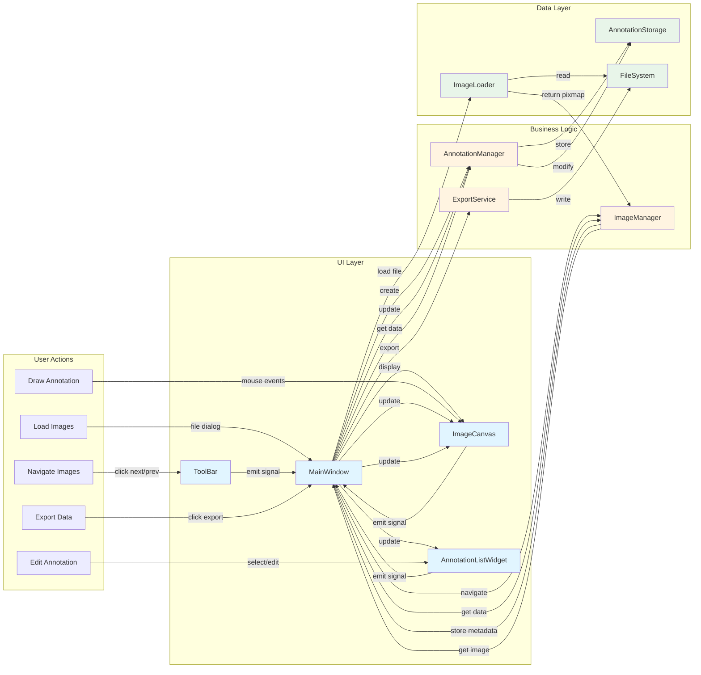
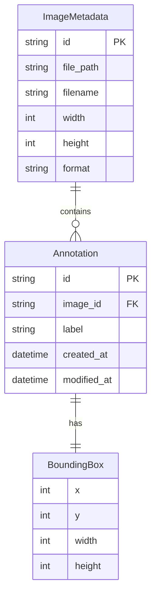
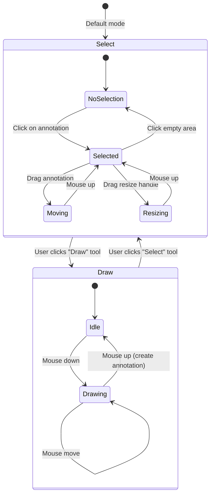

# Image Annotation Software - Implementation Plan

## Executive Summary

This document provides a comprehensive implementation plan for a PyQt-based image annotation software with clean architecture that supports future ML model integration and web deployment.

**Timeline**: 1-hour MVP
**Language**: Python 3.10+
**UI Framework**: PyQt6
**Architecture**: Three-layer design (UI → Business Logic → Data)

---

## Table of Contents

1. [Architecture Overview](#architecture-overview)
2. [System Design Diagrams](#system-design-diagrams)
3. [Project Structure](#project-structure)
4. [Class Designs](#class-designs)
5. [Implementation Sequence](#implementation-sequence)
6. [Dependencies](#dependencies)
7. [Future Extensibility](#future-extensibility)
8. [Code Quality Standards](#code-quality-standards)

---

## Architecture Overview

### Three-Layer Architecture

The system is designed with strict separation of concerns to enable future extensibility:

```
┌─────────────────────────────────────────────────────────────┐
│                    PRESENTATION LAYER                        │
│              (PyQt UI - Replaceable for Web)                 │
│  - MainWindow, ImageCanvas, ToolBar, AnnotationListWidget   │
└──────────────────────┬──────────────────────────────────────┘
                       │ (calls methods, receives events)
┌──────────────────────▼──────────────────────────────────────┐
│                   BUSINESS LOGIC LAYER                       │
│              (Framework-Agnostic Core Logic)                 │
│  - AnnotationManager, ImageManager, ExportService            │
│  - Domain Models: Image, Annotation, BoundingBox            │
└──────────────────────┬──────────────────────────────────────┘
                       │ (reads/writes data)
┌──────────────────────▼──────────────────────────────────────┐
│                      DATA LAYER                              │
│              (Persistence & File I/O)                        │
│  - ImageLoader, AnnotationStorage, ExportWriter             │
└─────────────────────────────────────────────────────────────┘
```

### Key Design Principles

1. **UI Independence**: Business logic has ZERO PyQt dependencies
2. **Future ML Ready**: Clean integration points for SAM/DINO models
3. **Web Migration Ready**: Business logic can be wrapped with REST API (FastAPI)
4. **Single Responsibility**: Each class has one clear purpose
5. **Testability**: Core logic fully testable without UI

---

## System Design Diagrams

### 1. Overall System Architecture



### 2. Class Diagram - Core Models



### 3. Class Diagram - Business Logic Layer



### 4. Class Diagram - UI Layer


### 5. Sequence Diagram - Create Annotation Workflow



### 6. Sequence Diagram - Export Workflow



### 7. Sequence Diagram - Navigate Between Images



### 8. Component Interaction Diagram



### 9. Data Model Relationships



### 10. State Machine - Drawing Mode



---

## Project Structure

### Directory Layout

```
/Users/aloksh/Documents/sandbox/image_annotate/
├── app.py                          # Entry point (PyQt application setup)
├── requirements.txt                # Project dependencies
│
├── core/                           # Business Logic Layer (Framework-Agnostic)
│   ├── __init__.py
│   ├── models.py                   # Domain models: Image, Annotation, BoundingBox
│   ├── annotation_manager.py      # Core annotation business logic
│   ├── image_manager.py           # Image handling and navigation
│   └── export_service.py          # Export logic (CSV, COCO JSON)
│
├── data/                           # Data Layer (Persistence)
│   ├── __init__.py
│   ├── image_loader.py            # Image file loading/caching
│   ├── annotation_storage.py     # In-memory annotation storage
│   └── export_writer.py          # File writing utilities
│
├── ui/                             # Presentation Layer (PyQt-specific)
│   ├── __init__.py
│   ├── main_window.py             # Main application window
│   ├── image_canvas.py            # Interactive image display & drawing
│   ├── annotation_list_widget.py  # List of annotations with edit/delete
│   ├── toolbar.py                 # Tool selection (rectangle, select, etc.)
│   └── dialogs.py                 # Label input, export dialogs
│
└── utils/                          # Shared utilities
    ├── __init__.py
    ├── constants.py               # App-wide constants
    └── validators.py              # Input validation utilities
```

---

## Class Designs

### Core Layer (`core/models.py`)

**Purpose**: Framework-agnostic domain models that can be used by both desktop and web versions.

```python
class BoundingBox:
    """Represents a rectangular bounding box."""

    Attributes:
        - x: int (top-left x coordinate)
        - y: int (top-left y coordinate)
        - width: int
        - height: int

    Methods:
        - to_dict() -> dict  # For JSON serialization
        - from_dict(data: dict) -> BoundingBox
        - contains_point(x: int, y: int) -> bool
        - to_coco_format() -> list[float]  # [x, y, width, height]
        - to_csv_format() -> str  # "x,y,width,height"


class Annotation:
    """Single annotation on an image."""

    Attributes:
        - id: str (UUID)
        - bounding_box: BoundingBox
        - label: str
        - image_id: str (reference to parent image)
        - created_at: datetime
        - modified_at: datetime

    Methods:
        - to_dict() -> dict
        - from_dict(data: dict) -> Annotation
        - update_box(box: BoundingBox) -> None
        - update_label(label: str) -> None


class ImageMetadata:
    """Image information without pixel data."""

    Attributes:
        - id: str (UUID)
        - file_path: str (absolute path)
        - filename: str
        - width: int
        - height: int
        - format: str (JPEG, PNG)
        - annotations: list[Annotation]

    Methods:
        - to_dict() -> dict
        - from_dict(data: dict) -> ImageMetadata
        - add_annotation(annotation: Annotation) -> None
        - remove_annotation(annotation_id: str) -> bool
        - get_annotation(annotation_id: str) -> Annotation | None
```

### Core Layer (`core/annotation_manager.py`)

**Purpose**: Business logic for annotation operations (framework-agnostic).

```python
class AnnotationManager:
    """
    Central business logic for managing annotations.
    Framework-agnostic - can be used with PyQt, web API, or CLI.

    FUTURE EXTENSIBILITY:
    - add_auto_annotation() method for ML model integration
    - validate_annotation() hook for custom validation rules
    """

    Attributes:
        - _annotations: dict[str, Annotation]  # annotation_id -> Annotation
        - _validation_enabled: bool

    Methods:
        # Core CRUD operations
        - create_annotation(image_id: str, box: BoundingBox, label: str) -> Annotation
        - get_annotation(annotation_id: str) -> Annotation | None
        - update_annotation(annotation_id: str, box: BoundingBox = None, label: str = None) -> bool
        - delete_annotation(annotation_id: str) -> bool

        # Query operations
        - get_annotations_for_image(image_id: str) -> list[Annotation]
        - get_all_annotations() -> list[Annotation]

        # Validation
        - validate_annotation(annotation: Annotation) -> tuple[bool, str]

        # Future ML integration point
        - suggest_annotations(image_id: str, model_name: str) -> list[Annotation]
            # Placeholder for SAM/DINO integration
```

### Core Layer (`core/image_manager.py`)

**Purpose**: Manage image collection and navigation.

```python
class ImageManager:
    """
    Manages loaded images and navigation between them.
    Framework-agnostic business logic.
    """

    Attributes:
        - _images: dict[str, ImageMetadata]  # image_id -> metadata
        - _image_order: list[str]  # Ordered list of image IDs
        - _current_index: int

    Methods:
        # Image loading
        - add_image(file_path: str, metadata: ImageMetadata) -> str  # Returns image_id
        - remove_image(image_id: str) -> bool

        # Navigation
        - get_current_image() -> ImageMetadata | None
        - next_image() -> ImageMetadata | None
        - previous_image() -> ImageMetadata | None
        - goto_image(image_id: str) -> bool
        - get_image_count() -> int
        - get_current_index() -> int

        # Query
        - get_image(image_id: str) -> ImageMetadata | None
        - get_all_images() -> list[ImageMetadata]
```

### Core Layer (`core/export_service.py`)

**Purpose**: Framework-agnostic export logic.

```python
class ExportService:
    """
    Handles export of annotations to various formats.
    Framework-agnostic - works with any UI or API.
    """

    Methods:
        # CSV Export
        - export_to_csv(images: list[ImageMetadata], output_path: str) -> bool
            # Format: image_name, x, y, width, height, label

        # COCO JSON Export
        - export_to_coco(images: list[ImageMetadata], output_path: str) -> bool
            # Standard COCO format with images, annotations, categories

        # Helper methods
        - _generate_csv_rows(images: list[ImageMetadata]) -> list[dict]
        - _generate_coco_structure(images: list[ImageMetadata]) -> dict
        - _get_unique_labels(images: list[ImageMetadata]) -> list[str]
```

**COCO JSON Structure:**

```json
{
  "images": [
    {"id": 1, "file_name": "image1.jpg", "width": 1920, "height": 1080}
  ],
  "annotations": [
    {"id": 1, "image_id": 1, "category_id": 1, "bbox": [100, 200, 50, 75]}
  ],
  "categories": [
    {"id": 1, "name": "person"}
  ]
}
```

### Data Layer (`data/image_loader.py`)

**Purpose**: Handle actual image file I/O and pixel data.

```python
class ImageLoader:
    """
    Loads image files and manages pixel data caching.
    Separated from business logic for clean architecture.
    """

    Attributes:
        - _cache: dict[str, QPixmap]  # image_id -> cached pixmap (optional)
        - _cache_size_limit: int

    Methods:
        - load_image(file_path: str) -> tuple[QPixmap, ImageMetadata]
            # Returns both pixel data and metadata

        - validate_file(file_path: str) -> bool
            # Check if file exists and is valid image format

        - get_supported_formats() -> list[str]
            # Returns ['.jpg', '.jpeg', '.png']

        - clear_cache() -> None
```

### UI Layer (`ui/main_window.py`)

**Purpose**: Main PyQt window that orchestrates UI components.

```python
class MainWindow(QMainWindow):
    """
    Main application window.
    Coordinates UI components and delegates business logic to core layer.
    """

    Attributes:
        - annotation_manager: AnnotationManager  # Business logic
        - image_manager: ImageManager  # Business logic
        - export_service: ExportService  # Business logic
        - image_loader: ImageLoader  # Data layer

        # UI Components
        - canvas: ImageCanvas
        - toolbar: ToolBar
        - annotation_list: AnnotationListWidget
        - status_bar: QStatusBar

    Methods:
        # Setup
        - _init_ui() -> None
        - _setup_menu_bar() -> None
        - _connect_signals() -> None

        # File operations (delegates to managers)
        - load_images() -> None  # Opens file dialog, calls image_manager
        - export_annotations() -> None  # Opens dialog, calls export_service

        # Event handlers
        - _on_annotation_created(annotation: Annotation) -> None
        - _on_annotation_selected(annotation_id: str) -> None
        - _on_annotation_deleted(annotation_id: str) -> None
        - _on_next_image() -> None
        - _on_previous_image() -> None
```

### UI Layer (`ui/image_canvas.py`)

**Purpose**: Interactive canvas for displaying images and drawing annotations.

```python
class ImageCanvas(QWidget):
    """
    Custom widget for image display and interactive annotation drawing.
    Emits signals for user actions, delegates business logic to AnnotationManager.
    """

    Signals:
        - annotation_created: Signal(BoundingBox, str)  # box, label
        - annotation_selected: Signal(str)  # annotation_id
        - annotation_moved: Signal(str, BoundingBox)  # annotation_id, new_box

    Attributes:
        - _pixmap: QPixmap  # Current image
        - _current_annotations: list[Annotation]  # Annotations for current image
        - _drawing_mode: str  # 'draw', 'select', 'edit'
        - _temp_box: BoundingBox | None  # Box being drawn
        - _selected_annotation_id: str | None

    Methods:
        # Display
        - set_image(pixmap: QPixmap) -> None
        - set_annotations(annotations: list[Annotation]) -> None
        - clear() -> None

        # Drawing state
        - set_mode(mode: str) -> None  # 'draw', 'select', 'edit'

        # Event handlers
        - paintEvent(event: QPaintEvent) -> None
            # Renders image + all bounding boxes
        - mousePressEvent(event: QMouseEvent) -> None
        - mouseMoveEvent(event: QMouseEvent) -> None
        - mouseReleaseEvent(event: QMouseEvent) -> None

        # Rendering helpers
        - _draw_bounding_box(painter: QPainter, box: BoundingBox, selected: bool) -> None
        - _draw_label(painter: QPainter, box: BoundingBox, label: str) -> None
```

### UI Layer (`ui/annotation_list_widget.py`)

**Purpose**: Display and manage list of annotations.

```python
class AnnotationListWidget(QWidget):
    """
    List widget showing all annotations for current image.
    Allows selection, editing, deletion.
    """

    Signals:
        - annotation_selected: Signal(str)  # annotation_id
        - annotation_deleted: Signal(str)  # annotation_id
        - annotation_edited: Signal(str, str)  # annotation_id, new_label

    Methods:
        - set_annotations(annotations: list[Annotation]) -> None
        - clear() -> None
        - select_annotation(annotation_id: str) -> None
        - _on_delete_clicked() -> None
        - _on_edit_clicked() -> None
```

### UI Layer (`ui/toolbar.py`)

**Purpose**: Tool selection and actions.

```python
class ToolBar(QToolBar):
    """
    Main toolbar with drawing tools and actions.
    """

    Signals:
        - mode_changed: Signal(str)  # 'draw', 'select', 'edit'
        - next_image_requested: Signal()
        - previous_image_requested: Signal()

    Methods:
        - _init_tools() -> None
            # Creates buttons for: Draw, Select, Next, Previous
```

### UI Layer (`ui/dialogs.py`)

**Purpose**: Dialog windows for user input.

```python
class LabelInputDialog(QDialog):
    """Simple dialog to input annotation label."""
    Methods:
        - get_label() -> str | None

class ExportDialog(QDialog):
    """Dialog for export options (format, path)."""
    Methods:
        - get_export_config() -> dict  # {format: 'csv'|'coco', path: str}
```

---

## Implementation Sequence

### Phase 1: Foundation (15 minutes)

**Goal**: Establish data models and business logic skeleton.

#### Step 1.1: Project Setup (3 min)

**Files to create:**
- All directories: `core/`, `data/`, `ui/`, `utils/`
- All `__init__.py` files
- `requirements.txt`

**Requirements.txt content:**
```
PyQt6>=6.4.0
Pillow>=9.5.0
```

#### Step 1.2: Core Models (7 min)

**File**: [core/models.py](core/models.py)

Implement in order:
1. `BoundingBox` class - Simple data class with x, y, width, height
2. `Annotation` class - Uses BoundingBox, adds label and metadata
3. `ImageMetadata` class - Contains list of Annotations

**Key implementation notes:**
- Use `@dataclass` decorator for clean code
- Add `to_dict()` and `from_dict()` for serialization
- Use `uuid.uuid4()` for generating IDs

#### Step 1.3: Core Managers (5 min)

**File**: [core/annotation_manager.py](core/annotation_manager.py)

Implement basic CRUD:
- `create_annotation()` - Generate UUID, store in dict
- `get_annotations_for_image()` - Filter by image_id
- `delete_annotation()` - Remove from dict

**File**: [core/image_manager.py](core/image_manager.py)

Implement basic navigation:
- `add_image()` - Store metadata, maintain order
- `get_current_image()` - Return current
- `next_image()` / `previous_image()` - Navigate with index

**Deliverable**: Foundation layer with data models and business logic skeleton.

---

### Phase 2: Data Layer (10 minutes)

**Goal**: Enable loading and validating image files.

#### Step 2.1: Image Loading (7 min)

**File**: [data/image_loader.py](data/image_loader.py)

Implement:
- `load_image()` - Use PyQt6's QPixmap to load image
- `validate_file()` - Check file exists and has valid extension
- Extract metadata (width, height, format) from loaded image

**Key implementation notes:**
```python
from PyQt6.QtGui import QPixmap, QImageReader

pixmap = QPixmap(file_path)
if pixmap.isNull():
    raise ValueError("Invalid image file")

width = pixmap.width()
height = pixmap.height()
```

#### Step 2.2: Constants (3 min)

**File**: [utils/constants.py](utils/constants.py)

Define:
```python
SUPPORTED_FORMATS = ['.jpg', '.jpeg', '.png']
DEFAULT_BOX_COLOR = '#00FF00'
SELECTED_BOX_COLOR = '#FF0000'
BOX_LINE_WIDTH = 2
```

**Deliverable**: Can load and validate image files.

---

### Phase 3: Basic UI (20 minutes)

**Goal**: Working UI that can load images, draw rectangles, and assign labels.

#### Step 3.1: Main Window Structure (5 min)

**File**: [ui/main_window.py](ui/main_window.py)

Implement:
- Basic `QMainWindow` setup
- Menu bar with "File" → "Load Images" action
- Status bar
- Initialize business logic managers (AnnotationManager, ImageManager, etc.)

**Layout**:
```python
# Central widget with layout
central_widget = QWidget()
layout = QVBoxLayout()

# Will add canvas and annotation list later
central_widget.setLayout(layout)
self.setCentralWidget(central_widget)
```

#### Step 3.2: Image Canvas - Display Only (7 min)

**File**: [ui/image_canvas.py](ui/image_canvas.py)

Implement (display-only first):
- `set_image()` - Store QPixmap
- `paintEvent()` - Draw image scaled to fit widget
- Basic layout and sizing

**Key implementation notes:**
```python
def paintEvent(self, event):
    painter = QPainter(self)
    if self._pixmap:
        # Scale pixmap to fit widget while maintaining aspect ratio
        scaled = self._pixmap.scaled(
            self.size(),
            Qt.AspectRatioMode.KeepAspectRatio,
            Qt.TransformationMode.SmoothTransformation
        )
        painter.drawPixmap(0, 0, scaled)
```

#### Step 3.3: Wire Load Images (3 min)

**In**: [ui/main_window.py](ui/main_window.py)

Implement `load_images()`:
```python
def load_images(self):
    file_paths, _ = QFileDialog.getOpenFileNames(
        self,
        "Select Images",
        "",
        "Images (*.jpg *.jpeg *.png)"
    )

    for path in file_paths:
        pixmap, metadata = self.image_loader.load_image(path)
        image_id = self.image_manager.add_image(path, metadata)

    # Display first image
    current = self.image_manager.get_current_image()
    if current:
        pixmap, _ = self.image_loader.load_image(current.file_path)
        self.canvas.set_image(pixmap)
```

**Test**: Should be able to load and display an image!

#### Step 3.4: Image Canvas - Drawing (5 min)

**In**: [ui/image_canvas.py](ui/image_canvas.py)

Implement mouse events:
```python
def mousePressEvent(self, event):
    if self._drawing_mode == 'draw':
        self._start_point = event.pos()

def mouseMoveEvent(self, event):
    if self._drawing_mode == 'draw' and self._start_point:
        self._temp_box = BoundingBox(
            x=self._start_point.x(),
            y=self._start_point.y(),
            width=event.pos().x() - self._start_point.x(),
            height=event.pos().y() - self._start_point.y()
        )
        self.update()  # Trigger repaint

def mouseReleaseEvent(self, event):
    if self._drawing_mode == 'draw' and self._temp_box:
        self.annotation_created.emit(self._temp_box)
        self._temp_box = None
```

Update `paintEvent()` to draw temporary box and existing annotations.

#### Step 3.5: Label Dialog (3 min)

**File**: [ui/dialogs.py](ui/dialogs.py)

Simple implementation:
```python
class LabelInputDialog(QDialog):
    def __init__(self, parent=None):
        super().__init__(parent)
        self.setWindowTitle("Enter Label")

        layout = QVBoxLayout()
        self.input = QLineEdit()
        layout.addWidget(QLabel("Annotation Label:"))
        layout.addWidget(self.input)

        buttons = QDialogButtonBox(
            QDialogButtonBox.StandardButton.Ok |
            QDialogButtonBox.StandardButton.Cancel
        )
        buttons.accepted.connect(self.accept)
        buttons.rejected.connect(self.reject)
        layout.addWidget(buttons)

        self.setLayout(layout)

    def get_label(self):
        return self.input.text() if self.result() else None
```

#### Step 3.6: Wire Annotation Creation (2 min)

**In**: [ui/main_window.py](ui/main_window.py)

Connect canvas signal:
```python
def _connect_signals(self):
    self.canvas.annotation_created.connect(self._on_annotation_created)

def _on_annotation_created(self, box: BoundingBox):
    dialog = LabelInputDialog(self)
    if dialog.exec():
        label = dialog.get_label()
        if label:
            current_image = self.image_manager.get_current_image()
            annotation = self.annotation_manager.create_annotation(
                current_image.id, box, label
            )
            current_image.add_annotation(annotation)
            self.canvas.set_annotations(current_image.annotations)
            self.status_bar.showMessage(f"Created annotation: {label}")
```

#### Step 3.7: Entry Point (2 min)

**File**: [app.py](app.py)

```python
import sys
from PyQt6.QtWidgets import QApplication
from ui.main_window import MainWindow

def main():
    app = QApplication(sys.argv)
    window = MainWindow()
    window.setWindowTitle("Image Annotation Tool")
    window.resize(1200, 800)
    window.show()
    sys.exit(app.exec())

if __name__ == "__main__":
    main()
```

**Deliverable**: Can load image, draw rectangles, assign labels!

---

### Phase 4: Navigation & List (10 minutes)

**Goal**: Navigate between images and manage annotations.

#### Step 4.1: Annotation List Widget (5 min)

**File**: [ui/annotation_list_widget.py](ui/annotation_list_widget.py)

```python
class AnnotationListWidget(QWidget):
    annotation_deleted = pyqtSignal(str)  # annotation_id

    def __init__(self):
        super().__init__()
        layout = QVBoxLayout()

        self.list_widget = QListWidget()
        self.delete_btn = QPushButton("Delete Selected")
        self.delete_btn.clicked.connect(self._on_delete_clicked)

        layout.addWidget(QLabel("Annotations:"))
        layout.addWidget(self.list_widget)
        layout.addWidget(self.delete_btn)
        self.setLayout(layout)

    def set_annotations(self, annotations):
        self.list_widget.clear()
        for ann in annotations:
            item = QListWidgetItem(f"{ann.label} - {ann.id[:8]}")
            item.setData(Qt.ItemDataRole.UserRole, ann.id)
            self.list_widget.addItem(item)

    def _on_delete_clicked(self):
        current = self.list_widget.currentItem()
        if current:
            annotation_id = current.data(Qt.ItemDataRole.UserRole)
            self.annotation_deleted.emit(annotation_id)
```

#### Step 4.2: Toolbar (3 min)

**File**: [ui/toolbar.py](ui/toolbar.py)

```python
class ToolBar(QToolBar):
    next_image_requested = pyqtSignal()
    previous_image_requested = pyqtSignal()

    def __init__(self):
        super().__init__()

        self.prev_btn = QPushButton("← Previous")
        self.next_btn = QPushButton("Next →")

        self.prev_btn.clicked.connect(self.previous_image_requested.emit)
        self.next_btn.clicked.connect(self.next_image_requested.emit)

        self.addWidget(self.prev_btn)
        self.addWidget(self.next_btn)
```

#### Step 4.3: Wire Navigation in MainWindow (2 min)

**In**: [ui/main_window.py](ui/main_window.py)

Add toolbar and annotation list to layout:
```python
def _init_ui(self):
    # ... existing code ...

    self.toolbar = ToolBar()
    self.addToolBar(self.toolbar)

    self.annotation_list = AnnotationListWidget()

    # Layout: canvas on left, annotation list on right
    main_layout = QHBoxLayout()
    main_layout.addWidget(self.canvas, stretch=3)
    main_layout.addWidget(self.annotation_list, stretch=1)
```

Connect signals:
```python
def _connect_signals(self):
    # ... existing ...
    self.toolbar.next_image_requested.connect(self._on_next_image)
    self.toolbar.previous_image_requested.connect(self._on_previous_image)
    self.annotation_list.annotation_deleted.connect(self._on_annotation_deleted)

def _on_next_image(self):
    next_img = self.image_manager.next_image()
    if next_img:
        self._display_image(next_img)

def _on_previous_image(self):
    prev_img = self.image_manager.previous_image()
    if prev_img:
        self._display_image(prev_img)

def _display_image(self, image_metadata):
    pixmap, _ = self.image_loader.load_image(image_metadata.file_path)
    self.canvas.set_image(pixmap)
    self.canvas.set_annotations(image_metadata.annotations)
    self.annotation_list.set_annotations(image_metadata.annotations)

    idx = self.image_manager.get_current_index()
    total = self.image_manager.get_image_count()
    self.status_bar.showMessage(f"Image {idx+1}/{total}")

def _on_annotation_deleted(self, annotation_id):
    current_image = self.image_manager.get_current_image()
    current_image.remove_annotation(annotation_id)
    self.annotation_manager.delete_annotation(annotation_id)
    self._display_image(current_image)  # Refresh
```

**Deliverable**: Can navigate between images and delete annotations!

---

### Phase 5: Export (5 minutes)

**Goal**: Export annotations to CSV and COCO JSON.

#### Step 5.1: Export Service (10 min)

**File**: [core/export_service.py](core/export_service.py)

Implement CSV export:
```python
import csv
import json
from pathlib import Path

class ExportService:
    def export_to_csv(self, images: list, output_path: str) -> bool:
        try:
            with open(output_path, 'w', newline='') as f:
                writer = csv.writer(f)
                writer.writerow(['image_name', 'x', 'y', 'width', 'height', 'label'])

                for image in images:
                    for ann in image.annotations:
                        writer.writerow([
                            image.filename,
                            ann.bounding_box.x,
                            ann.bounding_box.y,
                            ann.bounding_box.width,
                            ann.bounding_box.height,
                            ann.label
                        ])
            return True
        except Exception as e:
            print(f"CSV export error: {e}")
            return False
```

Implement COCO JSON export:
```python
def export_to_coco(self, images: list, output_path: str) -> bool:
    try:
        # Get unique labels for categories
        labels = self._get_unique_labels(images)
        categories = [
            {"id": idx+1, "name": label}
            for idx, label in enumerate(labels)
        ]
        label_to_id = {label: idx+1 for idx, label in enumerate(labels)}

        # Build COCO structure
        coco_data = {
            "images": [],
            "annotations": [],
            "categories": categories
        }

        annotation_id = 1
        for img_idx, image in enumerate(images, start=1):
            # Add image info
            coco_data["images"].append({
                "id": img_idx,
                "file_name": image.filename,
                "width": image.width,
                "height": image.height
            })

            # Add annotations
            for ann in image.annotations:
                coco_data["annotations"].append({
                    "id": annotation_id,
                    "image_id": img_idx,
                    "category_id": label_to_id[ann.label],
                    "bbox": [
                        ann.bounding_box.x,
                        ann.bounding_box.y,
                        ann.bounding_box.width,
                        ann.bounding_box.height
                    ],
                    "area": ann.bounding_box.width * ann.bounding_box.height,
                    "iscrowd": 0
                })
                annotation_id += 1

        with open(output_path, 'w') as f:
            json.dump(coco_data, f, indent=2)

        return True
    except Exception as e:
        print(f"COCO export error: {e}")
        return False

def _get_unique_labels(self, images: list) -> list:
    labels = set()
    for image in images:
        for ann in image.annotations:
            labels.add(ann.label)
    return sorted(list(labels))
```

#### Step 5.2: Export Dialog (2 min)

**In**: [ui/dialogs.py](ui/dialogs.py)

```python
class ExportDialog(QDialog):
    def __init__(self, parent=None):
        super().__init__(parent)
        self.setWindowTitle("Export Annotations")

        layout = QVBoxLayout()

        # Format selection
        self.format_combo = QComboBox()
        self.format_combo.addItems(["CSV", "COCO JSON"])
        layout.addWidget(QLabel("Export Format:"))
        layout.addWidget(self.format_combo)

        # Path selection
        self.path_input = QLineEdit()
        browse_btn = QPushButton("Browse...")
        browse_btn.clicked.connect(self._browse)

        path_layout = QHBoxLayout()
        path_layout.addWidget(self.path_input)
        path_layout.addWidget(browse_btn)

        layout.addWidget(QLabel("Output File:"))
        layout.addLayout(path_layout)

        # Buttons
        buttons = QDialogButtonBox(
            QDialogButtonBox.StandardButton.Ok |
            QDialogButtonBox.StandardButton.Cancel
        )
        buttons.accepted.connect(self.accept)
        buttons.rejected.connect(self.reject)
        layout.addWidget(buttons)

        self.setLayout(layout)

    def _browse(self):
        file_path, _ = QFileDialog.getSaveFileName(
            self,
            "Save Annotations",
            "",
            "CSV Files (*.csv);;JSON Files (*.json)"
        )
        if file_path:
            self.path_input.setText(file_path)

    def get_export_config(self):
        if self.result():
            return {
                'format': self.format_combo.currentText(),
                'path': self.path_input.text()
            }
        return None
```

#### Step 5.3: Wire Export in MainWindow (1 min)

**In**: [ui/main_window.py](ui/main_window.py)

Add menu action:
```python
def _setup_menu_bar(self):
    menubar = self.menuBar()
    file_menu = menubar.addMenu("File")

    load_action = file_menu.addAction("Load Images")
    load_action.triggered.connect(self.load_images)

    export_action = file_menu.addAction("Export Annotations")
    export_action.triggered.connect(self.export_annotations)
```

Implement export:
```python
def export_annotations(self):
    dialog = ExportDialog(self)
    config = dialog.get_export_config()

    if config:
        images = self.image_manager.get_all_images()

        if config['format'] == 'CSV':
            success = self.export_service.export_to_csv(images, config['path'])
        else:  # COCO JSON
            success = self.export_service.export_to_coco(images, config['path'])

        if success:
            self.status_bar.showMessage(f"Exported to {config['path']}")
        else:
            self.status_bar.showMessage("Export failed!")
```

**Deliverable**: FULL MVP - Can annotate images and export to CSV/COCO JSON!

---

## Dependencies

### requirements.txt

```
PyQt6>=6.4.0          # UI framework (GPL with exceptions - free for open source)
Pillow>=9.5.0         # Image loading fallback (MIT-like license)
```

**Installation:**
```bash
pip install -r requirements.txt
```

**License Compatibility**: Both libraries use permissive licenses suitable for open-source and commercial projects.

---

## Future Extensibility

### 1. ML Model Integration (SAM, DINO)

**Integration Point**: [core/annotation_manager.py](core/annotation_manager.py)

```python
class AnnotationManager:
    def suggest_annotations(
        self,
        image_id: str,
        model: str = 'sam'
    ) -> list[Annotation]:
        """
        Generate automatic annotation suggestions using ML models.

        Future implementation steps:
        1. Get image pixel data from ImageManager
        2. Load model (SAM/DINO) - lazy loading to avoid startup cost
        3. Run inference on image
        4. Convert model output (masks/boxes) to Annotation objects
        5. Return suggestions (user can accept/reject in UI)

        Args:
            image_id: ID of image to annotate
            model: 'sam' (Segment Anything) or 'dino' (Detection Transformer)

        Returns:
            List of suggested Annotation objects
        """
        image_metadata = self._get_image_metadata(image_id)

        if model == 'sam':
            return self._suggest_with_sam(image_metadata)
        elif model == 'dino':
            return self._suggest_with_dino(image_metadata)
        else:
            raise ValueError(f"Unknown model: {model}")

    def _suggest_with_sam(self, image_metadata):
        """
        Future: Load SAM model and generate segmentation masks.

        Pseudo-code:
        1. from segment_anything import sam_model_registry, SamAutomaticMaskGenerator
        2. sam = sam_model_registry["vit_h"](checkpoint="sam_vit_h.pth")
        3. mask_generator = SamAutomaticMaskGenerator(sam)
        4. masks = mask_generator.generate(image_array)
        5. Convert masks to BoundingBox objects
        6. Return as Annotation objects with label="auto_detected"
        """
        # Placeholder for future implementation
        return []

    def _suggest_with_dino(self, image_metadata):
        """
        Future: Load DINO model and generate object detections.

        Pseudo-code:
        1. from transformers import DetrImageProcessor, DetrForObjectDetection
        2. processor = DetrImageProcessor.from_pretrained("facebook/detr-resnet-50")
        3. model = DetrForObjectDetection.from_pretrained("facebook/detr-resnet-50")
        4. Run inference
        5. Convert detections to BoundingBox + labels
        6. Return as Annotation objects
        """
        # Placeholder for future implementation
        return []
```

**UI Changes Needed:**

In [ui/toolbar.py](ui/toolbar.py), add:
```python
self.auto_annotate_btn = QPushButton("🤖 Auto-Annotate")
self.auto_annotate_btn.clicked.connect(self.auto_annotate_requested.emit)
```

In [ui/main_window.py](ui/main_window.py), add:
```python
def _on_auto_annotate(self):
    current_image = self.image_manager.get_current_image()

    # Show loading indicator
    self.status_bar.showMessage("Running auto-annotation...")

    # Get suggestions from ML model
    suggestions = self.annotation_manager.suggest_annotations(
        current_image.id,
        model='sam'  # or 'dino'
    )

    # Display suggestions in different color (e.g., orange instead of green)
    self.canvas.set_suggested_annotations(suggestions)

    # User can accept/reject each suggestion
    self.status_bar.showMessage(f"Found {len(suggestions)} suggestions")
```

**No Refactoring Required**: Business logic is already isolated, just add new methods!

---

### 2. Web API Deployment (FastAPI)

**Integration Point**: New `api/` module wraps existing core layer.

**Directory structure:**
```
api/
├── __init__.py
├── main.py              # FastAPI app
├── routes.py            # API endpoints
└── schemas.py           # Pydantic models for API
```

**File**: `api/main.py`

```python
from fastapi import FastAPI, UploadFile, File, HTTPException
from fastapi.middleware.cors import CORSMiddleware
from core.annotation_manager import AnnotationManager
from core.image_manager import ImageManager
from core.export_service import ExportService
from core.models import BoundingBox, Annotation
from api.schemas import AnnotationCreate, AnnotationUpdate

# Initialize app and business logic (same as desktop app!)
app = FastAPI(title="Image Annotation API")
annotation_manager = AnnotationManager()
image_manager = ImageManager()
export_service = ExportService()

# Enable CORS for web frontend
app.add_middleware(
    CORSMiddleware,
    allow_origins=["*"],
    allow_methods=["*"],
    allow_headers=["*"],
)

# API Endpoints - all reuse existing business logic

@app.post("/api/images")
async def upload_image(file: UploadFile = File(...)):
    """Upload an image file."""
    # Save file temporarily
    file_path = f"/tmp/{file.filename}"
    with open(file_path, "wb") as f:
        f.write(await file.read())

    # Use existing ImageLoader (same as desktop!)
    from data.image_loader import ImageLoader
    loader = ImageLoader()
    _, metadata = loader.load_image(file_path)

    # Use existing ImageManager (same as desktop!)
    image_id = image_manager.add_image(file_path, metadata)

    return {"image_id": image_id, "filename": file.filename}

@app.get("/api/images")
async def list_images():
    """Get all loaded images."""
    images = image_manager.get_all_images()
    return [img.to_dict() for img in images]

@app.get("/api/images/{image_id}")
async def get_image(image_id: str):
    """Get specific image metadata."""
    image = image_manager.get_image(image_id)
    if not image:
        raise HTTPException(status_code=404, detail="Image not found")
    return image.to_dict()

@app.post("/api/annotations")
async def create_annotation(data: AnnotationCreate):
    """
    Create a new annotation.
    Uses EXACT SAME business logic as desktop app!
    """
    box = BoundingBox(
        x=data.bbox['x'],
        y=data.bbox['y'],
        width=data.bbox['width'],
        height=data.bbox['height']
    )

    # Same method PyQt app uses!
    annotation = annotation_manager.create_annotation(
        data.image_id,
        box,
        data.label
    )

    return annotation.to_dict()

@app.get("/api/images/{image_id}/annotations")
async def get_annotations(image_id: str):
    """Get all annotations for an image."""
    annotations = annotation_manager.get_annotations_for_image(image_id)
    return [ann.to_dict() for ann in annotations]

@app.put("/api/annotations/{annotation_id}")
async def update_annotation(annotation_id: str, data: AnnotationUpdate):
    """Update an existing annotation."""
    box = None
    if data.bbox:
        box = BoundingBox(**data.bbox)

    success = annotation_manager.update_annotation(
        annotation_id,
        box=box,
        label=data.label
    )

    if not success:
        raise HTTPException(status_code=404, detail="Annotation not found")

    return {"success": True}

@app.delete("/api/annotations/{annotation_id}")
async def delete_annotation(annotation_id: str):
    """Delete an annotation."""
    success = annotation_manager.delete_annotation(annotation_id)
    if not success:
        raise HTTPException(status_code=404, detail="Annotation not found")
    return {"success": True}

@app.post("/api/export")
async def export_annotations(format: str = "csv"):
    """
    Export all annotations.
    Uses EXACT SAME export logic as desktop app!
    """
    images = image_manager.get_all_images()
    output_path = f"/tmp/export.{format}"

    if format == "csv":
        success = export_service.export_to_csv(images, output_path)
    elif format == "coco":
        success = export_service.export_to_coco(images, output_path)
    else:
        raise HTTPException(status_code=400, detail="Invalid format")

    if not success:
        raise HTTPException(status_code=500, detail="Export failed")

    return {"download_url": f"/downloads/{output_path}"}
```

**File**: `api/schemas.py`

```python
from pydantic import BaseModel
from typing import Optional

class AnnotationCreate(BaseModel):
    image_id: str
    bbox: dict  # {x: int, y: int, width: int, height: int}
    label: str

class AnnotationUpdate(BaseModel):
    bbox: Optional[dict] = None
    label: Optional[str] = None
```

**Web Frontend (React example)**:

```javascript
// Web UI calls REST API instead of Python methods directly
// Canvas drawing logic reimplemented in JavaScript

const canvas = document.getElementById('annotation-canvas');
let startPoint = null;

canvas.addEventListener('mousedown', (e) => {
    startPoint = {x: e.offsetX, y: e.offsetY};
});

canvas.addEventListener('mouseup', async (e) => {
    if (!startPoint) return;

    const bbox = {
        x: startPoint.x,
        y: startPoint.y,
        width: e.offsetX - startPoint.x,
        height: e.offsetY - startPoint.y
    };

    const label = prompt("Enter label:");

    // Call API - same business logic as desktop!
    const response = await fetch('/api/annotations', {
        method: 'POST',
        headers: {'Content-Type': 'application/json'},
        body: JSON.stringify({
            image_id: currentImageId,
            bbox: bbox,
            label: label
        })
    });

    const annotation = await response.json();
    drawAnnotation(annotation);  // Render on canvas

    startPoint = null;
});
```

**Key Points:**
- **Zero changes to core layer** - it's already framework-agnostic!
- FastAPI wraps existing business logic with HTTP endpoints
- Web UI implements drawing in JavaScript, calls API for storage
- Same data models (JSON serialization already implemented)
- Desktop and web versions share 100% of business logic code

---

## Code Quality Standards

### PEP 8 Compliance

- **Indentation**: 4 spaces (no tabs)
- **Line length**: 88 characters (Black formatter compatible)
- **Naming conventions**:
  - Classes: `PascalCase`
  - Functions/methods: `snake_case`
  - Constants: `UPPER_SNAKE_CASE`
  - Private methods: `_leading_underscore`

### Type Hints

All function signatures must include type hints:

```python
def create_annotation(
    self,
    image_id: str,
    box: BoundingBox,
    label: str
) -> Annotation:
    """Create a new annotation."""
    pass
```

### Docstrings

All public classes and methods must have docstrings:

```python
class AnnotationManager:
    """
    Central business logic for managing annotations.

    This class is framework-agnostic and can be used with PyQt,
    web APIs, or command-line interfaces.

    Attributes:
        _annotations: Dictionary mapping annotation IDs to Annotation objects
        _validation_enabled: Whether to validate annotations before creation

    Example:
        >>> manager = AnnotationManager()
        >>> box = BoundingBox(x=100, y=200, width=50, height=75)
        >>> ann = manager.create_annotation("img_1", box, "person")
        >>> print(ann.label)
        "person"
    """
```

### Comments

- **Module-level**: Purpose of the module and key design decisions
- **Inline comments**: Only for non-obvious logic
- **TODO comments**: Mark future improvements

```python
# TODO: Add caching to avoid reloading images from disk
# TODO: Implement undo/redo functionality
```

### Error Handling

- **Validate at boundaries**: User input (UI layer), file I/O (data layer)
- **Raise specific exceptions**: `ValueError`, `FileNotFoundError`, etc.
- **Clear error messages**: Help user understand what went wrong

```python
def load_image(self, file_path: str) -> tuple[QPixmap, ImageMetadata]:
    """Load an image file."""
    if not Path(file_path).exists():
        raise FileNotFoundError(f"Image file not found: {file_path}")

    pixmap = QPixmap(file_path)
    if pixmap.isNull():
        raise ValueError(f"Invalid image file or unsupported format: {file_path}")

    # ... rest of implementation
```

### Logging (Post-MVP)

For future debugging, add Python logging:

```python
import logging

logger = logging.getLogger(__name__)

class AnnotationManager:
    def create_annotation(self, image_id: str, box: BoundingBox, label: str):
        logger.info(f"Creating annotation for image {image_id} with label '{label}'")
        # ... implementation
```

---

## Testing Strategy (Post-MVP)

### Unit Tests

Test business logic in isolation:

```python
# tests/test_annotation_manager.py
import unittest
from core.annotation_manager import AnnotationManager
from core.models import BoundingBox

class TestAnnotationManager(unittest.TestCase):
    def setUp(self):
        self.manager = AnnotationManager()

    def test_create_annotation(self):
        box = BoundingBox(x=10, y=20, width=30, height=40)
        ann = self.manager.create_annotation("img_1", box, "cat")

        self.assertEqual(ann.label, "cat")
        self.assertEqual(ann.bounding_box.x, 10)
        self.assertIsNotNone(ann.id)

    def test_get_annotations_for_image(self):
        box1 = BoundingBox(x=10, y=20, width=30, height=40)
        box2 = BoundingBox(x=50, y=60, width=70, height=80)

        self.manager.create_annotation("img_1", box1, "cat")
        self.manager.create_annotation("img_2", box2, "dog")

        img1_anns = self.manager.get_annotations_for_image("img_1")
        self.assertEqual(len(img1_anns), 1)
        self.assertEqual(img1_anns[0].label, "cat")
```

### Integration Tests

Test full workflows:

```python
# tests/test_export.py
import unittest
import json
from core.export_service import ExportService
from core.models import ImageMetadata, Annotation, BoundingBox

class TestExport(unittest.TestCase):
    def test_coco_export_format(self):
        # Create test data
        img = ImageMetadata(
            id="img_1",
            file_path="/path/to/image.jpg",
            filename="image.jpg",
            width=1920,
            height=1080,
            format="JPEG",
            annotations=[]
        )

        box = BoundingBox(x=100, y=200, width=50, height=75)
        ann = Annotation(
            id="ann_1",
            bounding_box=box,
            label="person",
            image_id="img_1"
        )
        img.add_annotation(ann)

        # Export
        service = ExportService()
        output_path = "/tmp/test_export.json"
        success = service.export_to_coco([img], output_path)

        self.assertTrue(success)

        # Validate COCO format
        with open(output_path) as f:
            data = json.load(f)

        self.assertIn("images", data)
        self.assertIn("annotations", data)
        self.assertIn("categories", data)
        self.assertEqual(len(data["images"]), 1)
        self.assertEqual(len(data["annotations"]), 1)
        self.assertEqual(data["annotations"][0]["bbox"], [100, 200, 50, 75])
```

### Manual Testing Checklist

Before release, verify:

- [ ] Load JPEG image successfully
- [ ] Load PNG image successfully
- [ ] Draw multiple annotations on one image
- [ ] Annotations persist when navigating away and back
- [ ] Edit annotation label
- [ ] Delete annotation
- [ ] Navigate between multiple images (Next/Previous)
- [ ] Export to CSV produces valid format
- [ ] Export to COCO JSON produces valid format
- [ ] Application handles 4K image without freezing
- [ ] Error handling for invalid image files
- [ ] Error handling for file write failures

---

## Summary

This implementation plan provides:

✅ **Clean Architecture**: Three-layer design (UI → Business Logic → Data)
✅ **Framework Independence**: Core logic has zero PyQt dependencies
✅ **Future ML Ready**: Clear integration point for SAM/DINO models
✅ **Future Web Ready**: Business logic can be wrapped with FastAPI
✅ **1-Hour MVP Feasible**: Incremental phases with clear deliverables
✅ **Maintainability**: Well-structured, documented, testable code
✅ **Extensibility**: Easy to add features without refactoring

### Critical Files (Implementation Priority Order)

1. **[core/models.py](core/models.py)** - Foundation data structures
2. **[core/annotation_manager.py](core/annotation_manager.py)** - Core business logic
3. **[ui/image_canvas.py](ui/image_canvas.py)** - User interaction
4. **[ui/main_window.py](ui/main_window.py)** - Integration
5. **[core/export_service.py](core/export_service.py)** - Deliverable feature

### Next Steps

1. Install dependencies: `pip install -r requirements.txt`
2. Follow implementation sequence Phase 1 → Phase 5
3. Test after each phase to catch issues early
4. Iterate based on user feedback

---

**Questions or clarifications?** Feel free to ask before starting implementation!

---

## Phase 6: Import & Edit COCO Annotations (Post-MVP Enhancement)

**Status**: Not yet implemented
**Estimated Time**: 20-25 minutes
**Goal**: Load existing COCO JSON annotations, render them on canvas, and enable label editing for all annotations.

### Overview

This phase enables users to:
1. Import existing COCO JSON annotation files
2. Match imported annotations to loaded images
3. Render imported annotations on canvas (identical to manually created ones)
4. Edit labels of ANY annotation (both imported and manually created)
5. Continue annotating after import (seamless workflow)

**Important**: Imported annotations behave identically to manually created annotations - they can be selected, deleted, and edited.

### 6.1: Import Service (12 min)

**New File**: `core/import_service.py`

**Purpose**: Framework-agnostic service to load COCO JSON and convert to internal models.

```python
class ImportService:
    """
    Service for importing annotations from COCO JSON format.
    Framework-agnostic - works with any UI.
    """

    Methods:
        # Import from COCO JSON
        - import_from_coco(
            coco_path: str,
            base_image_path: str = None
          ) -> tuple[list[ImageMetadata], dict[str, str]]
            """
            Load COCO JSON and return ImageMetadata objects with annotations.

            Args:
                coco_path: Path to COCO JSON file
                base_image_path: Optional base directory for images
                                (if None, uses COCO file_name as-is)

            Returns:
                Tuple of (list of ImageMetadata, label_map)
                label_map: {label_id: label_name} for updating LabelManager

            Raises:
                FileNotFoundError: If COCO file doesn't exist
                ValueError: If COCO JSON is invalid format
            """

        # Helper methods
        - _validate_coco_format(coco_data: dict) -> bool
            # Validate has required keys: images, annotations, categories

        - _match_images_to_files(
            coco_images: list,
            base_path: str
          ) -> dict[int, str]
            # Match COCO image IDs to actual file paths
            # Returns: {coco_image_id: resolved_file_path}

        - _build_label_map(categories: list) -> dict[int, str]
            # Extract {label_id: label_name} from COCO categories

        - _convert_annotations(
            coco_annotations: list,
            label_map: dict
          ) -> dict[int, list[Annotation]]
            # Convert COCO annotations to internal Annotation objects
            # Returns: {coco_image_id: [Annotation, ...]}
```

**Implementation Details:**

```python
import json
from pathlib import Path
from datetime import datetime
from core.models import ImageMetadata, Annotation, BoundingBox

class ImportService:
    def import_from_coco(
        self,
        coco_path: str,
        base_image_path: str = None
    ) -> tuple[list[ImageMetadata], dict[str, str]]:
        """Import annotations from COCO JSON format."""

        # Load COCO JSON
        coco_path = Path(coco_path)
        if not coco_path.exists():
            raise FileNotFoundError(f"COCO file not found: {coco_path}")

        with open(coco_path, 'r') as f:
            coco_data = json.load(f)

        # Validate format
        if not self._validate_coco_format(coco_data):
            raise ValueError("Invalid COCO JSON format")

        # Extract categories (labels)
        label_map = self._build_label_map(coco_data['categories'])

        # Match COCO images to file paths
        image_path_map = self._match_images_to_files(
            coco_data['images'],
            base_image_path or str(coco_path.parent)
        )

        # Convert annotations
        annotations_by_image = self._convert_annotations(
            coco_data['annotations'],
            label_map
        )

        # Build ImageMetadata objects
        image_metadata_list = []
        for coco_img in coco_data['images']:
            coco_img_id = coco_img['id']

            # Get resolved file path
            file_path = image_path_map.get(coco_img_id)
            if not file_path:
                print(f"Warning: Could not find file for image ID {coco_img_id}")
                continue

            # Create ImageMetadata
            metadata = ImageMetadata(
                id=str(uuid.uuid4()),  # Generate new internal ID
                file_path=file_path,
                filename=coco_img['file_name'],
                width=coco_img['width'],
                height=coco_img['height'],
                format=Path(coco_img['file_name']).suffix.upper().lstrip('.'),
                annotations=annotations_by_image.get(coco_img_id, [])
            )

            image_metadata_list.append(metadata)

        return image_metadata_list, label_map

    def _validate_coco_format(self, coco_data: dict) -> bool:
        """Validate COCO JSON has required structure."""
        required_keys = ['images', 'annotations', 'categories']
        return all(key in coco_data for key in required_keys)

    def _match_images_to_files(
        self,
        coco_images: list,
        base_path: str
    ) -> dict[int, str]:
        """
        Match COCO image entries to actual file paths.

        Tries multiple strategies:
        1. Exact filename match in base_path
        2. Recursive search in base_path subdirectories
        3. Use file_name as relative path from base_path
        """
        base_path = Path(base_path)
        image_map = {}

        for img in coco_images:
            img_id = img['id']
            filename = img['file_name']

            # Strategy 1: Direct path (filename may include subdirs)
            candidate = base_path / filename
            if candidate.exists():
                image_map[img_id] = str(candidate.absolute())
                continue

            # Strategy 2: Search for filename only (ignore subdirs in file_name)
            basename = Path(filename).name
            candidate = base_path / basename
            if candidate.exists():
                image_map[img_id] = str(candidate.absolute())
                continue

            # Strategy 3: Recursive search
            matches = list(base_path.rglob(basename))
            if matches:
                image_map[img_id] = str(matches[0].absolute())
                continue

            print(f"Warning: Could not find image file: {filename}")

        return image_map

    def _build_label_map(self, categories: list) -> dict[int, str]:
        """Extract label mapping from COCO categories."""
        return {cat['id']: cat['name'] for cat in categories}

    def _convert_annotations(
        self,
        coco_annotations: list,
        label_map: dict
    ) -> dict[int, list[Annotation]]:
        """Convert COCO annotations to internal format."""
        annotations_by_image = {}

        for coco_ann in coco_annotations:
            image_id = coco_ann['image_id']
            category_id = coco_ann['category_id']
            bbox_coco = coco_ann['bbox']  # [x, y, width, height]

            # Create BoundingBox
            box = BoundingBox(
                x=int(bbox_coco[0]),
                y=int(bbox_coco[1]),
                width=int(bbox_coco[2]),
                height=int(bbox_coco[3])
            )

            # Create Annotation
            annotation = Annotation(
                id=str(uuid.uuid4()),  # Generate new internal ID
                bounding_box=box,
                label_id=category_id,
                label_name=label_map.get(category_id, f"unknown_{category_id}"),
                image_id="",  # Will be set when added to ImageMetadata
                created_at=datetime.now(),
                modified_at=datetime.now()
            )

            # Group by image
            if image_id not in annotations_by_image:
                annotations_by_image[image_id] = []
            annotations_by_image[image_id].append(annotation)

        return annotations_by_image
```

### 6.2: Edit Label Functionality (5 min)

**Modify**: `core/annotation_manager.py`

Add method to update annotation label:

```python
class AnnotationManager:
    # ... existing methods ...

    def update_annotation_label(
        self,
        annotation_id: str,
        new_label_id: int,
        new_label_name: str
    ) -> bool:
        """
        Update the label of an existing annotation.

        Args:
            annotation_id: ID of annotation to update
            new_label_id: New integer label ID
            new_label_name: New label name

        Returns:
            True if successful, False if annotation not found
        """
        annotation = self._annotations.get(annotation_id)
        if not annotation:
            return False

        annotation.label_id = new_label_id
        annotation.label_name = new_label_name
        annotation.modified_at = datetime.now()

        return True
```

### 6.3: Edit Label Dialog (3 min)

**Modify**: `ui/dialogs.py`

Add new dialog for editing labels:

```python
class EditLabelDialog(QDialog):
    """
    Dialog for editing an annotation's label.
    Shows dropdown of available labels from LabelManager.
    """

    def __init__(self, current_label_id: int, label_manager, parent=None):
        super().__init__(parent)
        self.setWindowTitle("Edit Label")
        self.label_manager = label_manager

        layout = QVBoxLayout()

        # Label dropdown
        self.label_combo = QComboBox()
        labels = label_manager.get_all_labels()  # {id: name}
        for label_id, label_name in sorted(labels.items()):
            self.label_combo.addItem(f"{label_id}: {label_name}", label_id)

        # Set current label as selected
        for i in range(self.label_combo.count()):
            if self.label_combo.itemData(i) == current_label_id:
                self.label_combo.setCurrentIndex(i)
                break

        layout.addWidget(QLabel("Select new label:"))
        layout.addWidget(self.label_combo)

        # Buttons
        buttons = QDialogButtonBox(
            QDialogButtonBox.StandardButton.Ok |
            QDialogButtonBox.StandardButton.Cancel
        )
        buttons.accepted.connect(self.accept)
        buttons.rejected.connect(self.reject)
        layout.addWidget(buttons)

        self.setLayout(layout)

    def get_selected_label(self) -> tuple[int, str] | None:
        """Return (label_id, label_name) if OK clicked, None otherwise."""
        if self.result():
            label_id = self.label_combo.currentData()
            label_name = self.label_combo.currentText().split(': ', 1)[1]
            return (label_id, label_name)
        return None
```

### 6.4: UI Integration - Import (4 min)

**Modify**: `ui/main_window.py`

Add import functionality:

```python
class MainWindow(QMainWindow):
    def __init__(self):
        # ... existing initialization ...
        self.import_service = ImportService()  # Add import service

    def _setup_menu_bar(self):
        # ... existing menu setup ...

        # Add Import action after Load Images
        import_action = file_menu.addAction("Import COCO Annotations")
        import_action.setShortcut("Ctrl+I")
        import_action.triggered.connect(self.import_annotations)

    def import_annotations(self) -> None:
        """
        Import annotations from COCO JSON file.
        Merges with existing images or loads new ones.
        """
        # Select COCO JSON file
        coco_path, _ = QFileDialog.getOpenFileName(
            self,
            "Select COCO JSON File",
            "",
            "JSON Files (*.json)"
        )

        if not coco_path:
            return

        # Ask for base image directory (optional)
        reply = QMessageBox.question(
            self,
            "Base Image Directory",
            "Do you want to specify a base directory for images?\n"
            "(If No, will use COCO JSON directory)",
            QMessageBox.StandardButton.Yes | QMessageBox.StandardButton.No
        )

        base_path = None
        if reply == QMessageBox.StandardButton.Yes:
            base_path = QFileDialog.getExistingDirectory(
                self,
                "Select Base Image Directory"
            )

        try:
            # Import annotations
            self.status_bar.showMessage("Importing annotations...")

            imported_images, label_map = self.import_service.import_from_coco(
                coco_path,
                base_path
            )

            # Update LabelManager with imported labels
            existing_labels = self.label_manager.get_all_labels()
            for label_id, label_name in label_map.items():
                if label_id not in existing_labels:
                    self.label_manager.add_label(label_id, label_name)

            # Add imported images to ImageManager
            loaded_count = 0
            for img_metadata in imported_images:
                # Add to image manager
                self.image_manager.add_image(img_metadata.file_path, img_metadata)

                # Register annotations with AnnotationManager
                for annotation in img_metadata.annotations:
                    annotation.image_id = img_metadata.id
                    self.annotation_manager._annotations[annotation.id] = annotation

                loaded_count += 1

            # Display first imported image
            if loaded_count > 0:
                self._display_current_image()

                total_annotations = sum(
                    len(img.annotations) for img in imported_images
                )

                QMessageBox.information(
                    self,
                    "Import Successful",
                    f"Imported {loaded_count} images with "
                    f"{total_annotations} annotations."
                )

                self.status_bar.showMessage(
                    f"Imported {loaded_count} images, {total_annotations} annotations"
                )

        except Exception as e:
            QMessageBox.critical(
                self,
                "Import Failed",
                f"Failed to import annotations:\n{str(e)}"
            )
            self.status_bar.showMessage("Import failed")
```

### 6.5: UI Integration - Edit Label (2 min)

**Modify**: `ui/main_window.py`

Wire up the "Edit Label" button:

```python
class MainWindow(QMainWindow):
    def _connect_signals(self):
        # ... existing signals ...

        # Connect Edit Label button from annotation list
        if self.annotation_list:
            self.annotation_list.annotation_edit_requested.connect(
                self._on_edit_label_requested
            )

    def _on_edit_label_requested(self, annotation_id: str) -> None:
        """
        Handle edit label request from annotation list.
        Shows dialog to select new label.
        """
        # Get current annotation
        annotation = self.annotation_manager.get_annotation(annotation_id)
        if not annotation:
            return

        # Show edit dialog
        dialog = EditLabelDialog(
            annotation.label_id,
            self.label_manager,
            self
        )

        if dialog.exec():
            result = dialog.get_selected_label()
            if result:
                new_label_id, new_label_name = result

                # Update annotation
                success = self.annotation_manager.update_annotation_label(
                    annotation_id,
                    new_label_id,
                    new_label_name
                )

                if success:
                    # Refresh display
                    current_image = self.image_manager.get_current_image()
                    if current_image:
                        self.canvas.set_annotations(current_image.annotations)
                        self.annotation_list.set_annotations(current_image.annotations)

                    self.status_bar.showMessage(
                        f"Updated label to: {new_label_name}"
                    )
```

### 6.6: Export Behavior Update (1 min)

**Modify**: `ui/main_window.py`

Update export to prevent accidental overwrites:

```python
def export_annotations(self) -> None:
    """Export annotations to file."""
    # ... existing validation code ...

    # Show file save dialog
    file_path, _ = QFileDialog.getSaveFileName(
        self,
        "Export Annotations",
        f"annotations{default_ext}",
        file_filter,
        options=QFileDialog.Option.DontConfirmOverwrite  # We'll confirm manually
    )

    if not file_path:
        return

    # Check if file exists and warn
    if Path(file_path).exists():
        reply = QMessageBox.question(
            self,
            "File Exists",
            f"File already exists:\n{file_path}\n\n"
            "Do you want to overwrite it?",
            QMessageBox.StandardButton.Yes | QMessageBox.StandardButton.No,
            QMessageBox.StandardButton.No  # Default to No
        )

        if reply == QMessageBox.StandardButton.No:
            return

    # ... continue with export ...
```

### Phase 6 Deliverables

✅ **Import from COCO JSON**: Load existing annotations with image matching
✅ **Render imported annotations**: Display identically to manual annotations
✅ **Edit any annotation label**: Works for both imported and manual annotations
✅ **Label compatibility**: Merge imported labels with existing label set
✅ **Export protection**: Warn before overwriting existing files

---

## Phase 7: Subdirectory Support (Post-MVP Enhancement)

**Status**: Not yet implemented
**Estimated Time**: 15-20 minutes
**Goal**: Support loading images from multiple subdirectories and preserve relative paths in COCO JSON.

### Overview

This phase enables users to:
1. Load images from multiple subdirectories under a base directory
2. Specify base path + list of relative subdirectory paths
3. Export COCO JSON with relative paths (e.g., `"train/images/cat.jpg"`)
4. Import COCO JSON and resolve images using base + relative paths
5. Maintain backward compatibility (optional feature)

**Use Case**:
```
dataset/
├── train/
│   └── images/
│       ├── cat1.jpg
│       ├── cat2.jpg
├── val/
│   └── images/
│       ├── dog1.jpg
│       ├── dog2.jpg
└── annotations.json  # Contains relative paths like "train/images/cat1.jpg"
```

### 7.1: Subdirectory Configuration Model (3 min)

**New File**: `core/models.py` (add new classes)

```python
@dataclass
class SubdirectoryConfig:
    """
    Configuration for loading images from subdirectories.
    """
    base_path: str
    subdirectories: list[str]  # Relative paths from base

    def __post_init__(self):
        """Validate paths exist."""
        base = Path(self.base_path)
        if not base.exists():
            raise ValueError(f"Base path does not exist: {self.base_path}")

        for subdir in self.subdirectories:
            full_path = base / subdir
            if not full_path.exists():
                raise ValueError(f"Subdirectory does not exist: {full_path}")

    def get_full_path(self, relative_path: str) -> str:
        """Convert relative path to absolute path."""
        return str(Path(self.base_path) / relative_path)

    def get_relative_path(self, absolute_path: str) -> str:
        """Convert absolute path to relative path (from base)."""
        abs_path = Path(absolute_path)
        base = Path(self.base_path)
        try:
            return str(abs_path.relative_to(base))
        except ValueError:
            # Path is not relative to base, return filename only
            return abs_path.name
```

### 7.2: Enhanced Image Loading (5 min)

**Modify**: `ui/dialogs.py`

Add new dialog for subdirectory loading:

```python
class SubdirectoryLoadDialog(QDialog):
    """
    Dialog for loading images from subdirectories.
    Allows user to specify base path and subdirectory list.
    """

    def __init__(self, parent=None):
        super().__init__(parent)
        self.setWindowTitle("Load Images from Subdirectories")
        self.resize(500, 400)

        layout = QVBoxLayout()

        # Base path selection
        base_layout = QHBoxLayout()
        self.base_path_input = QLineEdit()
        base_browse_btn = QPushButton("Browse...")
        base_browse_btn.clicked.connect(self._browse_base_path)
        base_layout.addWidget(QLabel("Base Directory:"))
        base_layout.addWidget(self.base_path_input)
        base_layout.addWidget(base_browse_btn)
        layout.addLayout(base_layout)

        # Subdirectory list
        layout.addWidget(QLabel("Subdirectories (relative to base):"))

        # List widget + add/remove buttons
        list_layout = QHBoxLayout()
        self.subdir_list = QListWidget()
        list_layout.addWidget(self.subdir_list)

        button_layout = QVBoxLayout()
        add_btn = QPushButton("Add...")
        remove_btn = QPushButton("Remove")
        add_btn.clicked.connect(self._add_subdirectory)
        remove_btn.clicked.connect(self._remove_subdirectory)
        button_layout.addWidget(add_btn)
        button_layout.addWidget(remove_btn)
        button_layout.addStretch()
        list_layout.addLayout(button_layout)

        layout.addLayout(list_layout)

        # Buttons
        buttons = QDialogButtonBox(
            QDialogButtonBox.StandardButton.Ok |
            QDialogButtonBox.StandardButton.Cancel
        )
        buttons.accepted.connect(self.accept)
        buttons.rejected.connect(self.reject)
        layout.addWidget(buttons)

        self.setLayout(layout)

    def _browse_base_path(self):
        """Browse for base directory."""
        path = QFileDialog.getExistingDirectory(
            self,
            "Select Base Directory"
        )
        if path:
            self.base_path_input.setText(path)

    def _add_subdirectory(self):
        """Add subdirectory to list."""
        base_path = self.base_path_input.text()
        if not base_path:
            QMessageBox.warning(
                self,
                "No Base Path",
                "Please select a base directory first."
            )
            return

        subdir = QFileDialog.getExistingDirectory(
            self,
            "Select Subdirectory",
            base_path
        )

        if subdir:
            # Make path relative to base
            try:
                relative = Path(subdir).relative_to(Path(base_path))
                self.subdir_list.addItem(str(relative))
            except ValueError:
                QMessageBox.warning(
                    self,
                    "Invalid Selection",
                    "Subdirectory must be under the base directory."
                )

    def _remove_subdirectory(self):
        """Remove selected subdirectory from list."""
        current = self.subdir_list.currentRow()
        if current >= 0:
            self.subdir_list.takeItem(current)

    def get_config(self) -> SubdirectoryConfig | None:
        """Return SubdirectoryConfig if OK clicked."""
        if self.result():
            base_path = self.base_path_input.text()
            subdirs = [
                self.subdir_list.item(i).text()
                for i in range(self.subdir_list.count())
            ]

            if not base_path or not subdirs:
                return None

            try:
                return SubdirectoryConfig(base_path, subdirs)
            except ValueError as e:
                QMessageBox.warning(self, "Invalid Configuration", str(e))
                return None

        return None
```

### 7.3: Enhanced Image Manager (3 min)

**Modify**: `core/image_manager.py`

Add support for relative paths:

```python
class ImageManager:
    def __init__(self):
        # ... existing attributes ...
        self._base_path: str | None = None  # Optional base path for relative paths

    def set_base_path(self, base_path: str) -> None:
        """Set base path for relative path resolution."""
        self._base_path = base_path

    def get_base_path(self) -> str | None:
        """Get current base path."""
        return self._base_path

    def load_from_subdirectories(
        self,
        config: SubdirectoryConfig,
        image_loader
    ) -> int:
        """
        Load all images from specified subdirectories.

        Args:
            config: SubdirectoryConfig with base path and subdirs
            image_loader: ImageLoader instance

        Returns:
            Number of images loaded
        """
        self._base_path = config.base_path
        loaded_count = 0

        for subdir in config.subdirectories:
            full_path = Path(config.base_path) / subdir

            # Find all images in this subdirectory
            image_extensions = ['.jpg', '.jpeg', '.png', '.bmp', '.gif']
            for ext in image_extensions:
                for img_path in full_path.glob(f'*{ext}'):
                    try:
                        pixmap, metadata = image_loader.load_image(str(img_path))

                        # Store relative path in filename for COCO export
                        relative_path = img_path.relative_to(config.base_path)
                        metadata.filename = str(relative_path)

                        self.add_image(str(img_path), metadata)
                        loaded_count += 1
                    except Exception as e:
                        print(f"Error loading {img_path}: {e}")

        return loaded_count
```

### 7.4: Enhanced Export Service (3 min)

**Modify**: `core/export_service.py`

Update COCO export to use relative paths:

```python
class ExportService:
    def export_to_coco(
        self,
        images: list[ImageMetadata],
        output_path: str,
        use_relative_paths: bool = True
    ) -> None:
        """
        Export annotations to COCO JSON format.

        Args:
            images: List of ImageMetadata objects
            output_path: Output JSON file path
            use_relative_paths: If True, use relative paths in file_name
                               (requires images to have relative paths in filename)
        """
        # ... existing validation ...

        for image_idx, image in enumerate(images, start=1):
            # Use filename field (may contain relative path like "train/images/cat.jpg")
            file_name = image.filename if use_relative_paths else Path(image.file_path).name

            coco_data["images"].append({
                "id": image_idx,
                "file_name": file_name,  # May be relative path
                "width": image.width,
                "height": image.height,
                "date_captured": "",
                "license": 0,
                "coco_url": "",
                "flickr_url": ""
            })

            # ... rest of annotation export ...
```

### 7.5: Enhanced Import Service (3 min)

**Modify**: `core/import_service.py`

Update import to handle relative paths with base path:

```python
class ImportService:
    def import_from_coco(
        self,
        coco_path: str,
        base_image_path: str = None
    ) -> tuple[list[ImageMetadata], dict[str, str]]:
        """
        Import annotations from COCO JSON format.

        Args:
            coco_path: Path to COCO JSON file
            base_image_path: Base directory for resolving relative image paths
                            If None, uses COCO JSON directory as base

        Returns:
            Tuple of (list of ImageMetadata, label_map)
        """
        # ... existing code ...

        # Use base_image_path if provided, otherwise use COCO file directory
        base_path = base_image_path or str(coco_path.parent)

        # _match_images_to_files already handles relative paths correctly
        image_path_map = self._match_images_to_files(
            coco_data['images'],
            base_path
        )

        # ... rest of import logic ...
```

### 7.6: UI Integration (3 min)

**Modify**: `ui/main_window.py`

Add menu option for subdirectory loading:

```python
class MainWindow(QMainWindow):
    def _setup_menu_bar(self):
        # ... existing menu setup ...

        # Add subdirectory loading option
        load_subdirs_action = file_menu.addAction("Load from Subdirectories...")
        load_subdirs_action.setShortcut("Ctrl+Shift+O")
        load_subdirs_action.triggered.connect(self.load_from_subdirectories)

    def load_from_subdirectories(self) -> None:
        """Load images from multiple subdirectories."""
        # Check if labels are defined
        if not self.label_manager.has_labels():
            QMessageBox.warning(
                self,
                "No Labels Defined",
                "Please define labels first using File → Define Labels."
            )
            self._show_label_setup_dialog()
            if not self.label_manager.has_labels():
                return

        # Show subdirectory selection dialog
        dialog = SubdirectoryLoadDialog(self)
        config = dialog.get_config()

        if not config:
            return

        try:
            # Load images from subdirectories
            self.status_bar.showMessage("Loading images from subdirectories...")

            loaded_count = self.image_manager.load_from_subdirectories(
                config,
                self.image_loader
            )

            if loaded_count > 0:
                self._display_current_image()
                QMessageBox.information(
                    self,
                    "Load Successful",
                    f"Loaded {loaded_count} images from subdirectories."
                )
                self.status_bar.showMessage(
                    f"Loaded {loaded_count} images"
                )
            else:
                QMessageBox.warning(
                    self,
                    "No Images",
                    "No images found in specified subdirectories."
                )

        except Exception as e:
            QMessageBox.critical(
                self,
                "Load Failed",
                f"Failed to load images:\n{str(e)}"
            )
```

### Phase 7 Deliverables

✅ **Subdirectory loading**: Load images from multiple subdirs under base path
✅ **Relative path preservation**: Store relative paths in COCO JSON export
✅ **Import with base path**: Resolve relative paths when importing COCO JSON
✅ **Backward compatibility**: Optional feature, doesn't break existing workflow
✅ **Flexible path resolution**: Handles various directory structures

---

## Updated Keyboard Shortcuts

After Phase 6 and 7:

| Action | Shortcut |
|--------|----------|
| **Load Images** | `Ctrl+O` |
| **Load from Subdirectories** | `Ctrl+Shift+O` |
| **Define Labels** | `Ctrl+L` |
| **Import COCO Annotations** | `Ctrl+I` |
| **Export Annotations** | `Ctrl+E` |
| **Exit Application** | `Ctrl+Q` |
| **Next Image** | `Right Arrow` or `Down Arrow` |
| **Previous Image** | `Left Arrow` or `Up Arrow` |
| **Delete Selected Annotation** | `Delete` |
| **Switch to Draw Mode** | `D` |
| **Switch to Select Mode** | `S` |

---

## Summary of Post-MVP Enhancements

**Phase 6 - Import & Edit**:
- Import existing COCO JSON annotations
- Match annotations to images intelligently
- Edit labels for any annotation (imported or manual)
- Seamless workflow integration

**Phase 7 - Subdirectory Support**:
- Load images from multiple subdirectories
- Preserve relative paths in COCO JSON
- Flexible path resolution on import
- Maintains backward compatibility

Both phases maintain the clean three-layer architecture and add zero dependencies to the core business logic layer.

---

# Phase 8: Auto-Annotation with SAM2 and Grounding DINO

**Goal**: Add ML-powered auto-annotation capabilities using SAM2 (Segment Anything Model 2) and Grounding DINO for automated object detection and segmentation.

**Timeline**: 3-4 hours
**Priority**: Post-MVP Enhancement
**Dependencies**: Phase 1-7 complete

---

## Phase 8 Overview

Auto-annotation will allow users to:
1. **Automatic Object Detection**: Use Grounding DINO to detect objects based on text prompts
2. **Automatic Segmentation**: Use SAM2 to generate precise masks and bounding boxes
3. **Semi-Automated Workflow**: AI suggests annotations, user reviews and accepts/rejects
4. **Batch Processing**: Process multiple images automatically
5. **Flexible Models**: Switch between SAM2 and Grounding DINO based on use case

### Why SAM2 and Grounding DINO?

**SAM2 (Segment Anything Model 2)**:
- Zero-shot segmentation (no training needed)
- Handles any object category
- Generates precise masks that can be converted to bounding boxes
- Best for: Generic object segmentation, when you want to detect "everything"

**Grounding DINO**:
- Open-vocabulary object detection
- Text-prompt based detection (e.g., "a person", "a red car")
- Combines DINO detection with grounding capabilities
- Best for: Specific object detection based on descriptions

---

## Architecture Integration

### Updated Three-Layer Architecture

```
┌─────────────────────────────────────────────────────────┐
│                  PRESENTATION LAYER                      │
│  - MainWindow (with Auto-Annotate menu)                 │
│  - AutoAnnotationDialog (model selection, config)       │
│  - ReviewSuggestionsDialog (accept/reject UI)           │
└──────────────────────┬──────────────────────────────────┘
                       │
┌──────────────────────▼──────────────────────────────────┐
│                BUSINESS LOGIC LAYER                      │
│  - AnnotationManager (with suggest_annotations())       │
│  - ModelManager (manages SAM2/DINO instances)           │
│  - AutoAnnotationService (orchestrates inference)       │
└──────────────────────┬──────────────────────────────────┘
                       │
┌──────────────────────▼──────────────────────────────────┐
│                   MODEL LAYER (NEW)                      │
│  - SAM2Wrapper (wraps SAM2 model)                       │
│  - GroundingDINOWrapper (wraps Grounding DINO)          │
│  - ModelConfig (model parameters)                        │
└─────────────────────────────────────────────────────────┘
```

### Design Principles for Phase 8

1. **Optional Dependency**: ML models are optional; app works without them
2. **Lazy Loading**: Models loaded only when needed (memory efficient)
3. **Framework-Agnostic Core**: Model wrappers are separate from business logic
4. **Graceful Degradation**: App shows helpful message if models unavailable
5. **User Control**: All suggestions require user approval

---

## Component Design

### 1. Model Layer (New)

#### models/model_config.py

```python
"""
Model configuration for auto-annotation.

This module defines configuration for SAM2 and Grounding DINO models.
"""

from dataclasses import dataclass
from enum import Enum
from typing import Optional


class ModelType(Enum):
    """Available model types for auto-annotation."""
    SAM2 = "sam2"
    GROUNDING_DINO = "grounding_dino"


@dataclass
class ModelConfig:
    """
    Configuration for ML models.

    Attributes:
        model_type: Type of model (SAM2 or Grounding DINO)
        checkpoint_path: Path to model checkpoint file
        config_path: Optional path to model config file
        device: Device to run inference on ('cuda' or 'cpu')
        confidence_threshold: Minimum confidence for detections (0.0-1.0)
    """
    model_type: ModelType
    checkpoint_path: str
    config_path: Optional[str] = None
    device: str = "cuda"
    confidence_threshold: float = 0.3

    def validate(self) -> tuple[bool, str]:
        """
        Validate configuration.

        Returns:
            Tuple of (is_valid, error_message)
        """
        if not self.checkpoint_path:
            return False, "Checkpoint path is required"

        if self.confidence_threshold < 0.0 or self.confidence_threshold > 1.0:
            return False, "Confidence threshold must be between 0.0 and 1.0"

        if self.device not in ["cuda", "cpu"]:
            return False, "Device must be 'cuda' or 'cpu'"

        return True, ""


@dataclass
class SAM2Config(ModelConfig):
    """
    SAM2-specific configuration.

    Attributes:
        points_per_side: Number of points per side for automatic mask generation
        pred_iou_thresh: IoU threshold for mask quality filtering
        stability_score_thresh: Stability score threshold for filtering
    """
    points_per_side: int = 32
    pred_iou_thresh: float = 0.88
    stability_score_thresh: float = 0.95

    def __post_init__(self):
        self.model_type = ModelType.SAM2


@dataclass
class GroundingDINOConfig(ModelConfig):
    """
    Grounding DINO-specific configuration.

    Attributes:
        text_prompt: Text prompt for object detection (e.g., "person . car . dog")
        box_threshold: Threshold for bounding box confidence
        text_threshold: Threshold for text similarity
    """
    text_prompt: str = ""
    box_threshold: float = 0.35
    text_threshold: float = 0.25

    def __post_init__(self):
        self.model_type = ModelType.GROUNDING_DINO
```

#### models/sam2_wrapper.py

```python
"""
SAM2 model wrapper for auto-annotation.

This module provides a clean interface to SAM2 model for generating
segmentation masks and bounding boxes.
"""

from typing import Optional, List
import numpy as np
from pathlib import Path

from core.models import Annotation, BoundingBox, ImageMetadata
from models.model_config import SAM2Config


class SAM2Wrapper:
    """
    Wrapper for SAM2 (Segment Anything Model 2).

    Provides methods to:
    - Load SAM2 model
    - Generate automatic masks for an image
    - Convert masks to bounding boxes
    - Create Annotation objects

    Example:
        >>> config = SAM2Config(checkpoint_path="sam2_checkpoint.pth")
        >>> sam2 = SAM2Wrapper(config)
        >>> annotations = sam2.generate_annotations(image_array, image_id=1)
    """

    def __init__(self, config: SAM2Config):
        """
        Initialize SAM2 wrapper.

        Args:
            config: SAM2Config object with model parameters

        Raises:
            ImportError: If SAM2 dependencies not installed
            FileNotFoundError: If checkpoint not found
        """
        self.config = config
        self.model = None
        self._check_dependencies()
        self._load_model()

    def _check_dependencies(self) -> None:
        """
        Check if SAM2 dependencies are installed.

        Raises:
            ImportError: If required packages not available
        """
        try:
            import torch
            import segment_anything_2 as sam2
        except ImportError as e:
            raise ImportError(
                "SAM2 dependencies not installed. "
                "Install with: pip install segment-anything-2 torch torchvision"
            ) from e

    def _load_model(self) -> None:
        """
        Load SAM2 model from checkpoint.

        Raises:
            FileNotFoundError: If checkpoint file doesn't exist
            RuntimeError: If model loading fails
        """
        import torch
        from segment_anything_2 import sam_model_registry, SamAutomaticMaskGenerator

        checkpoint_path = Path(self.config.checkpoint_path)
        if not checkpoint_path.exists():
            raise FileNotFoundError(
                f"SAM2 checkpoint not found: {checkpoint_path}"
            )

        try:
            # Determine model size from checkpoint name
            # e.g., sam2_hiera_large.pt -> hiera_l
            model_type = self._infer_model_type(checkpoint_path.name)

            sam = sam_model_registry[model_type](checkpoint=str(checkpoint_path))
            sam.to(device=self.config.device)

            # Create automatic mask generator
            self.mask_generator = SamAutomaticMaskGenerator(
                model=sam,
                points_per_side=self.config.points_per_side,
                pred_iou_thresh=self.config.pred_iou_thresh,
                stability_score_thresh=self.config.stability_score_thresh,
            )

            self.model = sam
            print(f"SAM2 model loaded successfully on {self.config.device}")

        except Exception as e:
            raise RuntimeError(f"Failed to load SAM2 model: {str(e)}") from e

    def _infer_model_type(self, checkpoint_name: str) -> str:
        """
        Infer SAM2 model type from checkpoint filename.

        Args:
            checkpoint_name: Name of checkpoint file

        Returns:
            Model type string (e.g., "hiera_l", "hiera_b")
        """
        name_lower = checkpoint_name.lower()

        if "large" in name_lower or "_l" in name_lower:
            return "hiera_l"
        elif "base" in name_lower or "_b" in name_lower:
            return "hiera_b"
        elif "small" in name_lower or "_s" in name_lower:
            return "hiera_s"
        elif "tiny" in name_lower or "_t" in name_lower:
            return "hiera_t"
        else:
            # Default to large
            return "hiera_l"

    def generate_annotations(
        self,
        image: np.ndarray,
        image_id: str,
        label_id: int = 1,
        label_name: str = "object"
    ) -> List[Annotation]:
        """
        Generate annotations for an image using SAM2.

        Args:
            image: Image as numpy array (H, W, 3) in RGB format
            image_id: ID of the image being annotated
            label_id: Label ID to assign to all detections
            label_name: Label name to assign to all detections

        Returns:
            List of Annotation objects with bounding boxes

        Raises:
            RuntimeError: If model not loaded or inference fails
        """
        if self.model is None:
            raise RuntimeError("SAM2 model not loaded")

        try:
            # Generate masks
            masks = self.mask_generator.generate(image)

            # Convert masks to annotations
            annotations = []
            for mask_data in masks:
                # Extract bounding box from mask
                bbox = mask_data['bbox']  # [x, y, width, height]

                # Filter by confidence (predicted_iou)
                if mask_data['predicted_iou'] < self.config.confidence_threshold:
                    continue

                # Create BoundingBox
                bounding_box = BoundingBox(
                    x=int(bbox[0]),
                    y=int(bbox[1]),
                    width=int(bbox[2]),
                    height=int(bbox[3])
                )

                # Create Annotation
                annotation = Annotation(
                    bounding_box=bounding_box,
                    label_id=label_id,
                    label_name=label_name,
                    image_id=image_id
                )

                annotations.append(annotation)

            return annotations

        except Exception as e:
            raise RuntimeError(f"SAM2 inference failed: {str(e)}") from e

    def unload_model(self) -> None:
        """Unload model to free memory."""
        if self.model is not None:
            del self.model
            del self.mask_generator
            self.model = None

            # Clear CUDA cache if using GPU
            if self.config.device == "cuda":
                import torch
                torch.cuda.empty_cache()

            print("SAM2 model unloaded")
```

#### models/grounding_dino_wrapper.py

```python
"""
Grounding DINO model wrapper for auto-annotation.

This module provides a clean interface to Grounding DINO model for
text-prompt based object detection.
"""

from typing import List
import numpy as np
from pathlib import Path

from core.models import Annotation, BoundingBox
from models.model_config import GroundingDINOConfig


class GroundingDINOWrapper:
    """
    Wrapper for Grounding DINO model.

    Provides methods to:
    - Load Grounding DINO model
    - Detect objects based on text prompts
    - Convert detections to Annotation objects

    Example:
        >>> config = GroundingDINOConfig(
        ...     checkpoint_path="gdino.pth",
        ...     config_path="gdino_config.py",
        ...     text_prompt="person . car . dog"
        ... )
        >>> dino = GroundingDINOWrapper(config)
        >>> annotations = dino.detect_objects(image_array, image_id=1)
    """

    def __init__(self, config: GroundingDINOConfig):
        """
        Initialize Grounding DINO wrapper.

        Args:
            config: GroundingDINOConfig object with model parameters

        Raises:
            ImportError: If Grounding DINO dependencies not installed
            FileNotFoundError: If checkpoint or config not found
        """
        self.config = config
        self.model = None
        self._check_dependencies()
        self._load_model()

    def _check_dependencies(self) -> None:
        """
        Check if Grounding DINO dependencies are installed.

        Raises:
            ImportError: If required packages not available
        """
        try:
            import torch
            import groundingdino
        except ImportError as e:
            raise ImportError(
                "Grounding DINO dependencies not installed. "
                "Install with: pip install groundingdino-py torch torchvision"
            ) from e

    def _load_model(self) -> None:
        """
        Load Grounding DINO model from checkpoint.

        Raises:
            FileNotFoundError: If checkpoint or config file doesn't exist
            RuntimeError: If model loading fails
        """
        import torch
        from groundingdino.util.inference import load_model

        checkpoint_path = Path(self.config.checkpoint_path)
        if not checkpoint_path.exists():
            raise FileNotFoundError(
                f"Grounding DINO checkpoint not found: {checkpoint_path}"
            )

        if self.config.config_path:
            config_path = Path(self.config.config_path)
            if not config_path.exists():
                raise FileNotFoundError(
                    f"Grounding DINO config not found: {config_path}"
                )
        else:
            raise ValueError("Grounding DINO requires config_path")

        try:
            self.model = load_model(
                model_config_path=str(self.config.config_path),
                model_checkpoint_path=str(self.config.checkpoint_path),
                device=self.config.device
            )

            print(f"Grounding DINO model loaded successfully on {self.config.device}")

        except Exception as e:
            raise RuntimeError(f"Failed to load Grounding DINO model: {str(e)}") from e

    def detect_objects(
        self,
        image: np.ndarray,
        image_id: str,
        text_prompt: Optional[str] = None,
        label_map: Optional[dict[str, tuple[int, str]]] = None
    ) -> List[Annotation]:
        """
        Detect objects in image using text prompt.

        Args:
            image: Image as numpy array (H, W, 3) in RGB format
            image_id: ID of the image being annotated
            text_prompt: Text prompt (e.g., "person . car . dog").
                        If None, uses config.text_prompt
            label_map: Optional mapping from prompt phrases to (label_id, label_name).
                      E.g., {"person": (1, "person"), "car": (2, "car")}

        Returns:
            List of Annotation objects with bounding boxes

        Raises:
            RuntimeError: If model not loaded or inference fails
            ValueError: If text_prompt is empty
        """
        if self.model is None:
            raise RuntimeError("Grounding DINO model not loaded")

        # Use provided text prompt or config default
        prompt = text_prompt if text_prompt else self.config.text_prompt
        if not prompt:
            raise ValueError("Text prompt cannot be empty")

        try:
            from groundingdino.util.inference import predict

            # Run inference
            boxes, logits, phrases = predict(
                model=self.model,
                image=image,
                caption=prompt,
                box_threshold=self.config.box_threshold,
                text_threshold=self.config.text_threshold,
                device=self.config.device
            )

            # Convert to annotations
            annotations = []
            h, w = image.shape[:2]

            for box, logit, phrase in zip(boxes, logits, phrases):
                # Filter by confidence
                if logit < self.config.confidence_threshold:
                    continue

                # Convert normalized box to pixel coordinates
                # box format: [cx_norm, cy_norm, w_norm, h_norm]
                cx, cy, box_w, box_h = box
                x = int((cx - box_w / 2) * w)
                y = int((cy - box_h / 2) * h)
                width = int(box_w * w)
                height = int(box_h * h)

                # Determine label from phrase
                if label_map and phrase in label_map:
                    label_id, label_name = label_map[phrase]
                else:
                    # Default: use phrase as label name, generate ID from hash
                    label_id = hash(phrase) % 1000
                    label_name = phrase

                # Create BoundingBox
                bounding_box = BoundingBox(
                    x=max(0, x),
                    y=max(0, y),
                    width=width,
                    height=height
                )

                # Create Annotation
                annotation = Annotation(
                    bounding_box=bounding_box,
                    label_id=label_id,
                    label_name=label_name,
                    image_id=image_id
                )

                annotations.append(annotation)

            return annotations

        except Exception as e:
            raise RuntimeError(f"Grounding DINO inference failed: {str(e)}") from e

    def unload_model(self) -> None:
        """Unload model to free memory."""
        if self.model is not None:
            del self.model
            self.model = None

            # Clear CUDA cache if using GPU
            if self.config.device == "cuda":
                import torch
                torch.cuda.empty_cache()

            print("Grounding DINO model unloaded")
```

### 2. Business Logic Layer Updates

#### core/auto_annotation_service.py (NEW)

```python
"""
Auto-annotation service for ML-powered annotation suggestions.

This module orchestrates the auto-annotation workflow, managing model
inference and annotation suggestion generation.
"""

from typing import List, Optional
import numpy as np
from pathlib import Path

from core.models import Annotation, ImageMetadata
from models.model_config import ModelType, SAM2Config, GroundingDINOConfig
from models.sam2_wrapper import SAM2Wrapper
from models.grounding_dino_wrapper import GroundingDINOWrapper


class AutoAnnotationService:
    """
    Service for managing auto-annotation with ML models.

    This class is framework-agnostic and handles:
    - Model initialization and lifecycle
    - Inference orchestration
    - Suggestion generation

    Example:
        >>> service = AutoAnnotationService()
        >>> sam2_config = SAM2Config(checkpoint_path="sam2.pth")
        >>> service.load_model(sam2_config)
        >>> suggestions = service.generate_suggestions(image_array, "img_1")
    """

    def __init__(self):
        """Initialize the auto-annotation service."""
        self.current_model = None
        self.current_model_type = None

    def is_model_loaded(self) -> bool:
        """Check if a model is currently loaded."""
        return self.current_model is not None

    def get_loaded_model_type(self) -> Optional[ModelType]:
        """Get the type of currently loaded model."""
        return self.current_model_type

    def load_model(self, config) -> None:
        """
        Load a model for auto-annotation.

        Args:
            config: SAM2Config or GroundingDINOConfig object

        Raises:
            ValueError: If config is invalid
            ImportError: If model dependencies not installed
            FileNotFoundError: If model files not found
        """
        # Validate config
        is_valid, error_msg = config.validate()
        if not is_valid:
            raise ValueError(f"Invalid config: {error_msg}")

        # Unload existing model if any
        if self.current_model is not None:
            self.unload_model()

        # Load appropriate model
        if isinstance(config, SAM2Config):
            self.current_model = SAM2Wrapper(config)
            self.current_model_type = ModelType.SAM2
        elif isinstance(config, GroundingDINOConfig):
            self.current_model = GroundingDINOWrapper(config)
            self.current_model_type = ModelType.GROUNDING_DINO
        else:
            raise ValueError(f"Unknown config type: {type(config)}")

    def unload_model(self) -> None:
        """Unload the currently loaded model to free memory."""
        if self.current_model is not None:
            self.current_model.unload_model()
            self.current_model = None
            self.current_model_type = None

    def generate_suggestions(
        self,
        image: np.ndarray,
        image_id: str,
        label_id: int = 1,
        label_name: str = "object",
        **kwargs
    ) -> List[Annotation]:
        """
        Generate annotation suggestions for an image.

        Args:
            image: Image as numpy array (H, W, 3) in RGB format
            image_id: ID of the image being annotated
            label_id: Default label ID (for SAM2)
            label_name: Default label name (for SAM2)
            **kwargs: Additional model-specific parameters

        Returns:
            List of suggested Annotation objects

        Raises:
            RuntimeError: If no model is loaded
        """
        if self.current_model is None:
            raise RuntimeError("No model loaded. Call load_model() first.")

        if self.current_model_type == ModelType.SAM2:
            return self.current_model.generate_annotations(
                image=image,
                image_id=image_id,
                label_id=label_id,
                label_name=label_name
            )

        elif self.current_model_type == ModelType.GROUNDING_DINO:
            text_prompt = kwargs.get('text_prompt')
            label_map = kwargs.get('label_map')
            return self.current_model.detect_objects(
                image=image,
                image_id=image_id,
                text_prompt=text_prompt,
                label_map=label_map
            )

        else:
            raise RuntimeError(f"Unknown model type: {self.current_model_type}")

    def batch_generate_suggestions(
        self,
        images: List[ImageMetadata],
        image_loader,
        **kwargs
    ) -> dict[str, List[Annotation]]:
        """
        Generate suggestions for multiple images.

        Args:
            images: List of ImageMetadata objects
            image_loader: ImageLoader instance for loading images
            **kwargs: Additional parameters for generate_suggestions()

        Returns:
            Dictionary mapping {image_id: [Annotation, ...]}

        Raises:
            RuntimeError: If no model is loaded
        """
        if self.current_model is None:
            raise RuntimeError("No model loaded. Call load_model() first.")

        suggestions_map = {}

        for img_metadata in images:
            try:
                # Load image
                from PIL import Image
                pil_image = Image.open(img_metadata.file_path).convert('RGB')
                image_array = np.array(pil_image)

                # Generate suggestions
                suggestions = self.generate_suggestions(
                    image=image_array,
                    image_id=img_metadata.id,
                    **kwargs
                )

                suggestions_map[img_metadata.id] = suggestions

            except Exception as e:
                print(f"Warning: Failed to process {img_metadata.filename}: {e}")
                suggestions_map[img_metadata.id] = []

        return suggestions_map
```

#### Update core/annotation_manager.py

```python
def suggest_annotations(
    self,
    image_id: str,
    model_name: str = 'sam2'
) -> list[Annotation]:
    """
    Generate automatic annotation suggestions using ML models.

    This method is now implemented in Phase 8 and delegates to
    AutoAnnotationService for actual inference.

    Args:
        image_id: ID of image to annotate
        model_name: Model to use ('sam2' or 'dino')

    Returns:
        List of suggested Annotation objects

    Note:
        This is a simplified interface. For full control,
        use AutoAnnotationService directly.
    """
    # This method remains as integration point
    # Actual implementation is in AutoAnnotationService
    # UI layer will use AutoAnnotationService directly
    return []
```

### 3. UI Layer Updates

#### ui/dialogs.py - Add AutoAnnotationDialog

```python
class AutoAnnotationDialog(QDialog):
    """
    Dialog for configuring auto-annotation settings.

    Allows user to:
    - Select model type (SAM2 or Grounding DINO)
    - Configure model parameters
    - Select checkpoint files
    - Set confidence thresholds

    Example:
        >>> dialog = AutoAnnotationDialog()
        >>> if dialog.exec():
        >>>     config = dialog.get_config()  # ModelConfig object
    """

    def __init__(self, parent=None):
        """Initialize the auto-annotation configuration dialog."""
        super().__init__(parent)
        self.setWindowTitle("Auto-Annotation Settings")
        self.resize(600, 500)

        layout = QVBoxLayout()

        # Model type selection
        layout.addWidget(QLabel("Select Model:"))
        self.model_combo = QComboBox()
        self.model_combo.addItem("SAM2 (Segment Anything Model 2)", "sam2")
        self.model_combo.addItem("Grounding DINO (Text-Prompted Detection)", "dino")
        self.model_combo.currentIndexChanged.connect(self._on_model_changed)
        layout.addWidget(self.model_combo)

        # Checkpoint path
        checkpoint_layout = QHBoxLayout()
        self.checkpoint_input = QLineEdit()
        self.checkpoint_input.setPlaceholderText("Path to model checkpoint...")
        checkpoint_browse = QPushButton("Browse...")
        checkpoint_browse.clicked.connect(self._browse_checkpoint)
        checkpoint_layout.addWidget(QLabel("Checkpoint:"))
        checkpoint_layout.addWidget(self.checkpoint_input, stretch=1)
        checkpoint_layout.addWidget(checkpoint_browse)
        layout.addLayout(checkpoint_layout)

        # Config path (for Grounding DINO)
        self.config_layout = QHBoxLayout()
        self.config_input = QLineEdit()
        self.config_input.setPlaceholderText("Path to model config...")
        config_browse = QPushButton("Browse...")
        config_browse.clicked.connect(self._browse_config)
        self.config_layout.addWidget(QLabel("Config:"))
        self.config_layout.addWidget(self.config_input, stretch=1)
        self.config_layout.addWidget(config_browse)
        layout.addLayout(self.config_layout)

        # Device selection
        device_layout = QHBoxLayout()
        device_layout.addWidget(QLabel("Device:"))
        self.device_combo = QComboBox()
        self.device_combo.addItem("CUDA (GPU)", "cuda")
        self.device_combo.addItem("CPU", "cpu")
        device_layout.addWidget(self.device_combo)
        device_layout.addStretch()
        layout.addLayout(device_layout)

        # Confidence threshold
        threshold_layout = QHBoxLayout()
        threshold_layout.addWidget(QLabel("Confidence Threshold:"))
        self.threshold_spin = QDoubleSpinBox()
        self.threshold_spin.setRange(0.0, 1.0)
        self.threshold_spin.setSingleStep(0.05)
        self.threshold_spin.setValue(0.3)
        threshold_layout.addWidget(self.threshold_spin)
        threshold_layout.addStretch()
        layout.addLayout(threshold_layout)

        # Model-specific settings stack
        self.settings_stack = QStackedWidget()

        # SAM2 settings
        sam2_widget = QWidget()
        sam2_layout = QVBoxLayout()
        sam2_layout.addWidget(QLabel("SAM2 will detect all objects in the image"))
        sam2_layout.addWidget(QLabel("Assign detected objects to label:"))
        self.sam2_label_combo = QComboBox()
        sam2_layout.addWidget(self.sam2_label_combo)
        sam2_widget.setLayout(sam2_layout)

        # Grounding DINO settings
        dino_widget = QWidget()
        dino_layout = QVBoxLayout()
        dino_layout.addWidget(QLabel("Enter detection prompt (separate classes with ' . '):"))
        self.dino_prompt_input = QLineEdit()
        self.dino_prompt_input.setPlaceholderText("e.g., person . car . dog")
        dino_layout.addWidget(self.dino_prompt_input)
        dino_layout.addWidget(QLabel("Labels will be matched automatically from prompt"))
        dino_widget.setLayout(dino_layout)

        self.settings_stack.addWidget(sam2_widget)  # Index 0
        self.settings_stack.addWidget(dino_widget)  # Index 1

        layout.addWidget(self.settings_stack)

        # Buttons
        buttons = QDialogButtonBox(
            QDialogButtonBox.StandardButton.Ok |
            QDialogButtonBox.StandardButton.Cancel
        )
        buttons.accepted.connect(self._validate_and_accept)
        buttons.rejected.connect(self.reject)
        layout.addWidget(buttons)

        self.setLayout(layout)

        # Initialize
        self._on_model_changed(0)

    def set_labels(self, label_manager):
        """Populate label dropdown with available labels."""
        self.label_manager = label_manager
        labels = label_manager.get_all_labels()

        self.sam2_label_combo.clear()
        for label_id, label_name in sorted(labels.items()):
            self.sam2_label_combo.addItem(f"{label_id}: {label_name}", label_id)

    def _on_model_changed(self, index):
        """Handle model selection change."""
        model_type = self.model_combo.currentData()

        if model_type == "sam2":
            self.settings_stack.setCurrentIndex(0)
            # Hide config path for SAM2
            for i in range(self.config_layout.count()):
                widget = self.config_layout.itemAt(i).widget()
                if widget:
                    widget.setVisible(False)
        else:  # dino
            self.settings_stack.setCurrentIndex(1)
            # Show config path for Grounding DINO
            for i in range(self.config_layout.count()):
                widget = self.config_layout.itemAt(i).widget()
                if widget:
                    widget.setVisible(True)

    def _browse_checkpoint(self):
        """Browse for checkpoint file."""
        path, _ = QFileDialog.getOpenFileName(
            self,
            "Select Model Checkpoint",
            "",
            "Model Files (*.pth *.pt *.ckpt);;All Files (*)"
        )
        if path:
            self.checkpoint_input.setText(path)

    def _browse_config(self):
        """Browse for config file."""
        path, _ = QFileDialog.getOpenFileName(
            self,
            "Select Model Config",
            "",
            "Python Files (*.py);;All Files (*)"
        )
        if path:
            self.config_input.setText(path)

    def _validate_and_accept(self):
        """Validate settings before accepting."""
        checkpoint = self.checkpoint_input.text().strip()
        if not checkpoint:
            QMessageBox.warning(self, "Missing Checkpoint",
                              "Please select a model checkpoint file")
            return

        model_type = self.model_combo.currentData()
        if model_type == "dino":
            config_path = self.config_input.text().strip()
            if not config_path:
                QMessageBox.warning(self, "Missing Config",
                                  "Grounding DINO requires a config file")
                return

            prompt = self.dino_prompt_input.text().strip()
            if not prompt:
                QMessageBox.warning(self, "Missing Prompt",
                                  "Please enter a detection prompt")
                return

        self.accept()

    def get_config(self):
        """
        Get the configured ModelConfig object.

        Returns:
            SAM2Config or GroundingDINOConfig based on selection
        """
        from models.model_config import SAM2Config, GroundingDINOConfig

        model_type = self.model_combo.currentData()
        checkpoint = self.checkpoint_input.text().strip()
        device = self.device_combo.currentData()
        threshold = self.threshold_spin.value()

        if model_type == "sam2":
            label_id = self.sam2_label_combo.currentData()
            label_text = self.sam2_label_combo.currentText()
            label_name = label_text.split(': ', 1)[1] if ': ' in label_text else label_text

            config = SAM2Config(
                checkpoint_path=checkpoint,
                device=device,
                confidence_threshold=threshold
            )
            # Store label info for later use
            config.default_label_id = label_id
            config.default_label_name = label_name
            return config

        else:  # dino
            config_path = self.config_input.text().strip()
            prompt = self.dino_prompt_input.text().strip()

            return GroundingDINOConfig(
                checkpoint_path=checkpoint,
                config_path=config_path,
                device=device,
                confidence_threshold=threshold,
                text_prompt=prompt
            )
```

#### ui/main_window.py Updates

Add to MainWindow class:

```python
def __init__(self):
    # ... existing code ...

    # Initialize auto-annotation service
    self.auto_annotation_service = None
    try:
        from core.auto_annotation_service import AutoAnnotationService
        self.auto_annotation_service = AutoAnnotationService()
    except ImportError:
        print("Auto-annotation dependencies not available")

def _create_menus(self):
    # ... existing code ...

    # Auto-Annotation menu
    auto_menu = self.menuBar().addMenu("Auto-Annotate")

    configure_action = auto_menu.addAction("Configure Model...")
    configure_action.setShortcut("Ctrl+M")
    configure_action.triggered.connect(self.configure_auto_annotation)

    run_current_action = auto_menu.addAction("Run on Current Image")
    run_current_action.setShortcut("Ctrl+R")
    run_current_action.triggered.connect(self.run_auto_annotation_current)

    run_all_action = auto_menu.addAction("Run on All Images...")
    run_all_action.triggered.connect(self.run_auto_annotation_batch)

    auto_menu.addSeparator()

    unload_action = auto_menu.addAction("Unload Model")
    unload_action.triggered.connect(self.unload_model)

def configure_auto_annotation(self):
    """Configure auto-annotation model."""
    if self.auto_annotation_service is None:
        QMessageBox.warning(
            self,
            "Not Available",
            "Auto-annotation requires additional dependencies.\n\n"
            "Install with:\n"
            "pip install segment-anything-2 groundingdino-py torch torchvision"
        )
        return

    from ui.dialogs import AutoAnnotationDialog

    dialog = AutoAnnotationDialog(self)
    dialog.set_labels(self.label_manager)

    if dialog.exec():
        config = dialog.get_config()

        try:
            self.status_bar.showMessage("Loading model...")
            QApplication.processEvents()  # Update UI

            self.auto_annotation_service.load_model(config)

            model_type = self.auto_annotation_service.get_loaded_model_type()
            QMessageBox.information(
                self,
                "Model Loaded",
                f"{model_type.value.upper()} model loaded successfully!\n\n"
                "You can now run auto-annotation on images."
            )
            self.status_bar.showMessage(f"{model_type.value.upper()} model ready")

        except Exception as e:
            QMessageBox.critical(
                self,
                "Model Load Failed",
                f"Failed to load model:\n{str(e)}"
            )
            self.status_bar.showMessage("Model load failed")

def run_auto_annotation_current(self):
    """Run auto-annotation on current image."""
    if self.auto_annotation_service is None or not self.auto_annotation_service.is_model_loaded():
        QMessageBox.warning(
            self,
            "No Model Loaded",
            "Please configure and load a model first.\n\n"
            "Use Auto-Annotate → Configure Model..."
        )
        return

    current_image = self.image_manager.get_current_image()
    if not current_image:
        QMessageBox.warning(self, "No Image", "Please load an image first")
        return

    try:
        # Load image as numpy array
        from PIL import Image
        import numpy as np

        self.status_bar.showMessage("Running auto-annotation...")
        QApplication.processEvents()

        pil_image = Image.open(current_image.file_path).convert('RGB')
        image_array = np.array(pil_image)

        # Generate suggestions
        model_type = self.auto_annotation_service.get_loaded_model_type()

        if model_type == ModelType.SAM2:
            # Get default label from config
            config = self.auto_annotation_service.current_model.config
            suggestions = self.auto_annotation_service.generate_suggestions(
                image=image_array,
                image_id=current_image.id,
                label_id=getattr(config, 'default_label_id', 1),
                label_name=getattr(config, 'default_label_name', 'object')
            )
        else:  # Grounding DINO
            # Build label map from current labels
            labels = self.label_manager.get_all_labels()
            label_map = {name: (lid, name) for lid, name in labels.items()}

            suggestions = self.auto_annotation_service.generate_suggestions(
                image=image_array,
                image_id=current_image.id,
                label_map=label_map
            )

        if not suggestions:
            QMessageBox.information(
                self,
                "No Detections",
                "No objects detected in the current image.\n\n"
                "Try adjusting the confidence threshold or using a different model."
            )
            self.status_bar.showMessage("No detections")
            return

        # Add suggestions to current image
        for suggestion in suggestions:
            current_image.add_annotation(suggestion)
            self.annotation_manager._annotations[suggestion.id] = suggestion

        # Refresh display
        self.canvas.set_annotations(current_image.annotations)
        self.annotation_list.set_annotations(current_image.annotations)

        self.status_bar.showMessage(
            f"Added {len(suggestions)} auto-annotations"
        )

        QMessageBox.information(
            self,
            "Auto-Annotation Complete",
            f"Added {len(suggestions)} annotation(s) to current image.\n\n"
            "Review and adjust as needed."
        )

    except Exception as e:
        QMessageBox.critical(
            self,
            "Auto-Annotation Failed",
            f"Failed to run auto-annotation:\n{str(e)}"
        )
        self.status_bar.showMessage("Auto-annotation failed")

def run_auto_annotation_batch(self):
    """Run auto-annotation on all images."""
    if self.auto_annotation_service is None or not self.auto_annotation_service.is_model_loaded():
        QMessageBox.warning(
            self,
            "No Model Loaded",
            "Please configure and load a model first"
        )
        return

    all_images = self.image_manager.get_all_images()
    if not all_images:
        QMessageBox.warning(self, "No Images", "Please load images first")
        return

    # Confirm batch processing
    reply = QMessageBox.question(
        self,
        "Batch Auto-Annotation",
        f"Run auto-annotation on all {len(all_images)} images?\n\n"
        "This may take several minutes depending on the number of images.",
        QMessageBox.StandardButton.Yes | QMessageBox.StandardButton.No,
        QMessageBox.StandardButton.No
    )

    if reply == QMessageBox.StandardButton.No:
        return

    try:
        # TODO: Show progress dialog
        self.status_bar.showMessage("Running batch auto-annotation...")
        QApplication.processEvents()

        # Batch process
        # (Implementation would include progress dialog)
        # ...

    except Exception as e:
        QMessageBox.critical(self, "Batch Failed", str(e))

def unload_model(self):
    """Unload current auto-annotation model."""
    if self.auto_annotation_service and self.auto_annotation_service.is_model_loaded():
        reply = QMessageBox.question(
            self,
            "Unload Model",
            "Unload the current model to free memory?",
            QMessageBox.StandardButton.Yes | QMessageBox.StandardButton.No
        )

        if reply == QMessageBox.StandardButton.Yes:
            self.auto_annotation_service.unload_model()
            self.status_bar.showMessage("Model unloaded")
            QMessageBox.information(self, "Model Unloaded",
                                  "Model unloaded successfully")
```

---

## Phase 8 Implementation Steps

### Step 1: Model Layer (2 hours)

1. Create `models/` directory
2. Implement `model_config.py` with config classes
3. Implement `sam2_wrapper.py` with SAM2 integration
4. Implement `grounding_dino_wrapper.py` with DINO integration
5. Test model loading and inference independently

### Step 2: Business Logic Layer (1 hour)

1. Create `core/auto_annotation_service.py`
2. Implement model management and inference orchestration
3. Update `core/annotation_manager.py` documentation
4. Add unit tests for service

### Step 3: UI Layer (1-2 hours)

1. Add `AutoAnnotationDialog` to `ui/dialogs.py`
2. Update `ui/main_window.py` with menu and handlers
3. Add progress dialog for batch processing
4. Implement review/accept workflow (optional enhancement)
5. Add keyboard shortcuts

### Step 4: Testing & Documentation (30 minutes)

1. Test with sample images
2. Update README with auto-annotation features
3. Add model download instructions
4. Document configuration examples

---

## Dependencies

Add to `requirements.txt`:

```
# Existing dependencies
PyQt6>=6.4.0
Pillow>=9.0.0

# Phase 8: Auto-Annotation (Optional)
# Uncomment and install only if using auto-annotation features
# torch>=2.0.0
# torchvision>=0.15.0
# segment-anything-2>=0.1.0
# groundingdino-py>=0.1.0
# numpy>=1.24.0
```

---

## Model Download Instructions

Users will need to download model checkpoints:

**SAM2**:
```bash
# Download SAM2 checkpoint
wget https://dl.fbaipublicfiles.com/segment_anything_2/072824/sam2_hiera_large.pt

# Or use huggingface
pip install huggingface_hub
python -c "from huggingface_hub import hf_hub_download; hf_hub_download(repo_id='facebook/sam2-hiera-large', filename='sam2_hiera_large.pt')"
```

**Grounding DINO**:
```bash
# Clone and download Grounding DINO
git clone https://github.com/IDEA-Research/GroundingDINO.git
cd GroundingDINO
wget https://github.com/IDEA-Research/GroundingDINO/releases/download/v0.1.0-alpha/groundingdino_swint_ogc.pth
```

---

## Phase 8 Deliverables

✅ **SAM2 Integration**: Automatic mask generation and bounding box extraction
✅ **Grounding DINO Integration**: Text-prompted object detection
✅ **Model Management**: Load, unload, switch between models
✅ **UI Integration**: Configuration dialog and menu commands
✅ **Batch Processing**: Auto-annotate multiple images
✅ **Framework-Agnostic**: Model layer separate from UI and business logic
✅ **Optional Dependency**: App works without ML models installed
✅ **Memory Efficient**: Models loaded on-demand, can be unloaded

---

## Keyboard Shortcuts (Updated)

| Action | Shortcut |
|--------|----------|
| **Configure Auto-Annotation** | `Ctrl+M` |
| **Run on Current Image** | `Ctrl+R` |
| (all previous shortcuts remain unchanged) |

---

## Future Enhancements Beyond Phase 8

- **Review Dialog**: Dedicated UI to review/accept/reject suggestions
- **Custom Training**: Fine-tune models on user's dataset
- **Model Zoo**: Support for additional models (YOLO, EfficientDet, etc.)
- **Active Learning**: Suggest most uncertain annotations for review
- **Tracking**: Video annotation with temporal consistency